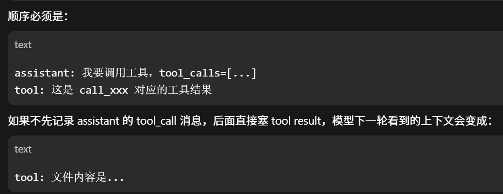
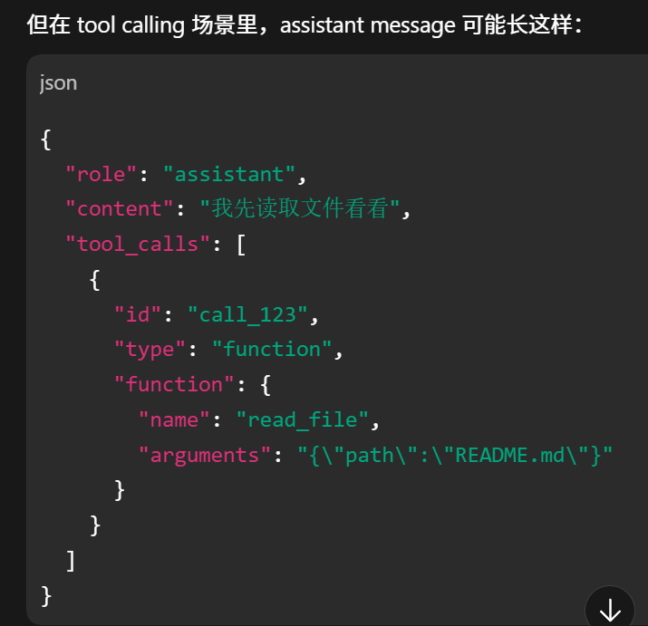
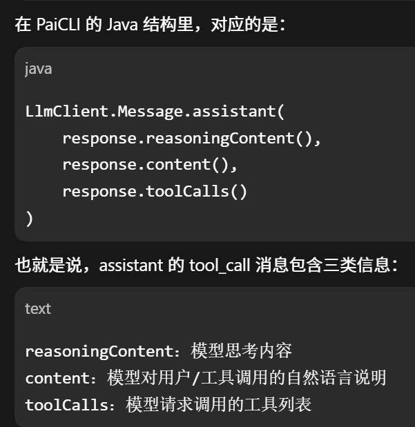
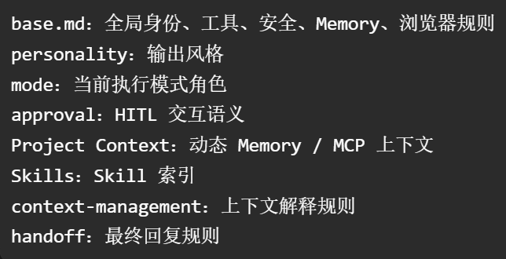

# 1. Agent如何知道调用哪一个工具呢?
- 在我当前的项目中, 我有一个 `ToolRegistry` 类, 这个类用于工具注册, 管理所有的tool. Agent构造请求时, 就会把所有的可以使用的tool(name, description, 和参数) 放到请求体的tools字段里面发送给LLM, LLM去判断调用哪一个工具, 返回一个tool_calls, 里面有这轮要使用的工具, Agent就从这个工具注册表里面找到它的执行逻辑去运行
- 重要的是, 在我的这个项目中, 判断调用哪一个工具主要看该工具描述的质量好不好
	- 一开始我有个execute_command这么一个tool, 给它的描述为执行shell命令, 然后我还有一个read_file的tool. 那时候LLM就经常用cat命令来代替read_file读取文件. 后来我在execute_command的描述里面加了, 只执行短时的Shell命令, 像ls, mvn test, 不要用于读取文件. 然后就基本上区分开这两个tool了
# 2. 你如何处理ReAct死循环的呢?

^792369

- 我做了5层防护
- 首先就是做了Token预算, 我根据当前模型的上下文窗口的80%作为分界点, 对话历史接近该预算就触发了摘要压缩强制终止
- 然后就是工具执行超时, 如果一个工具执行超过1分钟就强制终止返回超时结果, 防止卡住
- 其次就是做了用户取消, 用户可以按 ESC 或者输入 /cancel 取消当前的执行
- 还做了重复工具调用的检测, 如果连续三次调用的工具的名字和参数完全相同, 那么就强制停止
- 最后就是ReAct轮数达到50, 那么也会停止
# 3. 你的DAG如何工作的呢
- 我设计了两个字段分别是 `dependencies(依赖于哪些任务)` 和 `dependents(哪些任务依赖于它)` 
- 每个子任务都声明自己依赖于哪些前置任务, 形成一个有向图, 执行的时候使用拓扑排序对任务分批次去执行, 保证执行的速度
## 如果某个任务失败了呢?
- 任务执行失败的话, 就把它标记为FAILED, 同时把直接或间接依赖它的任务标记为SKIPPED, 直接跳过, 剩余的任务不受影响, 继续执行
# 4. 你的Mutil-Agent框架如何实现的呢? 
- 我实现了三个角色, 分别是 `Planner(规划者)` 拆解任务, `Worker(工作者)` 执行子任务 和 `Reviewer(检查者)` 审查Worker的执行结果
- 然后实现了一个 `AgentOrchestrator` 类作为Agent编排器, 使用的主从架构. 由该编排器去解析计划, 分配任务最后汇总结果, 协调这三个角色的交互. 
- 它们每个角色都算一个SubAgent, 都有自己的 System prompt 和 角色定义
## 各个角色的System prompt有啥不一样呢?
- 首先就是Planner, 它的prompt侧重于任务的分解还有依赖的分析, 要求输出一份结构化的JSON列表, 注意该角色不要涉及工具, 让它专注于计划
- 然后就是Worker, 它主要侧重于工具的使用还有执行, 拥有完整的工具使用的指导
- 最后就是Reviewer, 它侧重于Worker执行结果的质量标准和反馈, 要求返回通过或者不通过, 附带具体原因, 方便下一轮的重试
## Agent之间如何通信的呢? 
- 我当前的项目中实现的是进程内的Agent间的通信消息, 而不是像MCP/A2A那样跨进程的
- 具体来说就是 PaiCLI它是主从架构, 有一个主控 `AgentOrchestrator`, 下面有Planner, Worker, Reviewer三种Agent, 通过内部的AgnetMessage进行通信的
- 在AgentMessage里面有一个type字段, 该字段里面设置了几种消息类型像TASK, RESULT, APPROVAL等等. 主控向子Agent发送TASK, 字Agent返回RESULT, Reviewer可用返回APPROVAL, 如果调用失败就返回ERROR
## 总的来说流程是咋样的? 
- 第一步, 用户进入/team后, `AgentOrchestrator` 会创建一条任务消息, 发送Planner让它解析
- 第二步, Planner返回一个JSON, 里面有计划, Orchestrator会解析里面的任务然后转化为内部统一的step
- 第三步, Orchestrator根据依赖关系找出它们之间可以并行执行的步骤, 包装为TASK发送给Worker
- 第四步, Worker执行完后返回RESULT, Orchestrator 会把原任务和结果发送Reviewer, 
- 第五步, Reviewer返回审查结. 项目解析JSON, 优先看Approved字段, 如果解析失败了, 那么会用 `通过/不通过` 这些关键字兜底判定. 通过就把该step标记为completed; 不通过就把Reviewer反馈拼接到上下文中再发给Worker执行, 最多重试两次
- 第六步, 所有的步骤执行完之后, Orchestrator汇总结果返回
## 5. Reviewer审查不通过咋办呢?
- 首先就是Reviewer会返回一个JSON, 这个里面有该次审查是否通过以及没有通过的原因.如果通过了, 这一步Worker就会被标记为完成; 如果失败了, 那么就会解析Reviewer返回的结果, 把反馈内容拼接到原始任务里面交给同一个worker去执行. 
- 它最多重试两轮, 如果依旧不成功, 那么就保留当前结果, 同时打印超出最大重试次数, 这一步也会被标记为完成, 防止阻塞后续的步骤导致整个任务失败
### 可以改进吗, 如果上到生产方面?
- 可以修改为低风险任务保留结果继续, 高风险任务标记为FALIED, 阻断依赖步骤, 或者重新规划
### 为了只重试两次呢? 
- 这是为了控制成本. 每次重试都要经历Worker执行一次, Reviewer执行一次, 至少两次的LLM调用, 重试两次就是四次调用, 重试太多成本会上升
# 6. 并行工具的调用会有冲突吗?
- 会的. 如果有两个工具同时修改同一个文件, 那么就会有冲突, 我目前对于该场景的策略较为简单, 通过LLM不犯错误 + 工程兜底
-  我通过prompt来引导LLM把有依赖关系的操作分到不同的批次, 我在prompt中写道, 如果工具之间有依赖关系, 请分多轮调用.
- 工程兜底方面, 即使真的出现了冲突, 我也给每一个工具设置了独立的超时60s, 单个工具的卡死不会影响同批次其他工具的执行结果, 只会返回该工具的错误结果给LLM
# 7. 你的token预算如何做的管理呢?
- 首先就是模型上下文方面, 我根据当前的模型的 `maxContextWindow` 来计算其他参数, 就像是压缩阈值为窗口的90%; 短期记忆的预算是窗口的45%, 达到了该预算的90%时就会进行压缩, 而且如果大于了45%的阈值有淘汰机制, 会淘汰最旧的记忆
- 最后对于Agent循环的兜底方面, 我做了AgentBudget, 允许在启动时自己输入token预算用于ReAct和SubAgent的单次运行, 超出了该预算那么就会强制停止
# 8. 三种模式你咋选呢? 
- 如果是简单的问答, 单文件的修改, 那么就使用ReAct模式, 几步就搞定了; 如果是创建项目, 涉及到了多个文件到修改, 那么就可以使用Plan-and-Execute, 因为该任务步骤的, 而且相互直接有依赖关系, 先规划好再运行; 如果是那种大型的项目, 比较复杂, 那么就可以使用Mutil-Agent, 因为它可以分工协作, 并且有审查机制, 保障了代码的任务结果的质量
- 我的PaiCLI默认是ReAct, 可以通过/plan 或者 /team 来切换, 执行完之后自动返回ReAct模式
## 能不能让Agent自己判断使用哪种模式呢?
- 可以的. 我在用户问题的判断上面不是完全的交给大模型去自由发挥的. 当用户输入问题后, 首先会判断任务的特征: 看它是不是简单问答, 是否需要工具调用, 是否涉及多文件的修改, 是否可以明显的步骤依赖, 是否适合并行拆分, 等等. 简单的任务就会走ReAct; 有明确步骤和依赖的走Plan-and-Execute; 可以拆分成多个相对独立的子任务的可以升级为Mutil-Agent
# 9. 如何重零设计一个Agent呢?
- 第一步, 先写一个最小可用的ReAct循环. 可以通过一个while循环 + LLMClient接口 + ToolRegistry注册表. 先跑通 "用户输入->LLM推理->工具调用->结果输出->继续推理" 这条链路
- 第二步, 加护栏. 比如Token预算, 循环次数的上限, 工具调用的超时等等, 防止Agent失控. 
- 第三步, 加HITL. 加入人工审批, 防止高危工具被随意调用
- 第四步, 根据当前的业务来增加Agent的复杂度, 看是否需要Plan-and-Execute 或者 Mutil-Agent, 按需增加. 同时为工具的调用增加并行执行
- 第五步, 对该Agent进行抽象和可扩展的设计. 像LLMClient不要绑死一个模型, ToolRegistry支持动态注册其他的工具, Prompt从在代码里的硬编码拆分出来为一个单位的markdown文件, 方便随时修改
# 10. 你在Agent中具体做了什么?
- 我的这个Agent从最初的ReAct成为最终的支持Mutil-Agent的一个可交付的产品, 我主要负责了其中的三个板块
- 第一块就是Agetn引擎
	- 我实现了ReAct模式的主循环, 包括LLM的调用, 工具的执行, 上下文的管理这一整套的流程. Agent每次循环都要做预算检查, 工具调度等等, 这些机制都是我设计的
- 第二块就是Memory体系
	- 短期记忆, 长期记忆(用户显示保存 `/save`)
- 第三块就是系统提示词方面
	- [面](面.md#^9e8f1f)
# 11. 你的Agent loop咋设计的呢?
- 它就是一个ReAct循环. 大体流程就是LLM决策->工具执行->结果回灌->模型再决策. 
- 具体来说的话就是用户问题进来后, 会先根据该问题构建上下文, 先把用户输入写入短期记忆, 检索长期记忆, 注入system prompt, 替代conversationHistory[0]. 
- 然后就进入循环了, 会先检查是否有LSP注入, conversationHistory是否需要压缩, 然后通过AgentBudget判断是否超token预算, 超最大轮数限制, 出现重复工具调用, 都没有的话就会通过getDefinitions方法从toolRegistry中拿到所有的工具的Schema. 
- 然后就会把conversationHistory, 工具Schema传给LLM, LLM返回tool_calls, 

- 关于我的Agent循环, 核心就是通过一个While循环, 退出条件由LLM自己决定
- 我的每次循环都会做四件事: 
	- 第一件先检查预算, 看token使用了多少, 迭代了多少轮(50), 超出就退出循环
	- 第二件就是检查上下文是否需要压缩(90%)
	- 第三件是把对话历史和工具的定义传给LLM, 同时记录好token的使用量
	- 第四步看LLM的返回, 如果返回带有tool_calls, 那么就执行工具, 把执行结果保存到历史, 继续循环; 没有tool_calls, 那么就认为执行完毕, 退出循环
## 退出呢?
 - 详见 [[面](面.md)](面.md#^792369)
# 12. 工具调用逻辑使用了框架吗还是自己写的?
- 没有使用框架, 都是自己写的
- 第一步, 我的PaiCLI里面有一个ToolRegistry类, 这个类用来注册内置工具还有MCP, 当CLI启动的时候, 就会创建一个HitlToolRegistry, 它继承ToolRegistry. 
- 第二步, 每轮LLM调用前, 会把工具的Schema暴露给模型(通过 `Tool Definitions` 方法), 使得LLM可以看到每个工具的name, descripter 和 JSON schema, 让它可以精准选择工具
- 第三步, LLM返回tool_calls, Agent检测到调用了工具, 就会先把assistant的tool_call消息保存到对话历史里面(协议就是这么要求的, 不然就会变成下图)

- 第四步, Agent就会遍历返回的所有的tool_calls, 把它们转化为内部的ToolInvocation交给ToolRegistry去执行
- 第五步, 执行的时候会判断有几个工具, 如果就一个, 那么就执行; 如果有多个就并发执行(并发度为4), 结果按传入顺序搜集, 防止并发执行导致结果错乱
- 第六步, 在执行高危工具像写文件, 执行命令之类的, 会经过HITL判断. 就是会给用户弹出一个审批请求, 用户可以选择同意或者拒绝, 只有用户批准后才会开始执行该工具, 得到结果, Agent把结果灌回给模型, 继续下一轮

## 第四步为什么要转换为内部对象呢?
- 主要是为了**解耦模型协议和工具执行**, 这是因为LLM返回的结果偏向模型协议, 像 `id`, `function.name`, `function.arguments`, 转化为内部对象后, 可以变为像 `id`, `name`, `arguments` 这样子的, 同时还可以给它**加其他的自定义字段**. 
- 同时更重要的是**统一了不同工具的执行入口**, 而且**方便并行执行与结果的排序**

- assistant message: 如下图, 就是这个东西, tool_call就是模型发出的调用工具的意图, 像 `我先读文件看看`
 	
# 13. System Prompt是咋设计的呢?

^9e8f1f

- 我的Prompt是动态拼装的, 而且是分层进行的. 总的来说, 整个提示词被分成了8层.
- 第一层是base.md, 这里面定义了PaiCLI的身份, 语言要求, 还有工具的列表, 如何使用等等
- 第二层是calm.md, 该markdown文件很短, 主要用来约束模型的风格, 固定模型的输出语气.
- 第三层就是mode prompt, 像ReAct, Plan, Mutil-Agent模式, 各自有各自的markdown文件, 用来告诉Agent在不同模式下的不同工作形式
- 第四层就是suggest.md, 用于审批策略的, 告诉模型哪些工具需要用户手动确认
- 第五层就是动态上下文, 包含了记忆的注入和外部上下源
- 第六层就是Skill索引, 在用户具体加载skill时下一轮会把具体的Skill内容注入, 防止Prompt膨胀
- 第七层就是统一的上下文管理, 告诉模型这些动态注入的内容如何使用
- 第八层就是handoff.md, 用来约束模型的最终回答

## 那你的提示词文件放在哪里呢? 支持用户自定义吗?
- 我设置了三层优先级: 
	- 第一层默认从内置的resources/prompts/目录下加载, 这是默认的
	- 第二层是用户目录, 从 ~/.paicli/prompts/目录下加载, 用户可以在这里写自己的提示词, 支持覆盖
	- 第三层是项目级别, 从项目目录 .paicli/prompts/加载, 优先级最高, 适合定制化
- 我这个设计参考了Claude Code的CLAUDE.md的机制, 同时进一步做了prompt的分层和覆盖, 可以让不同的项目有不同的Agent的行为
# 14. 用户输入到返回的全流程
-  第一步, 用户输入进来后会先做上下文的构建, 它会根据当前问题从长期记忆里检索相关信息, 拼装到系统提示词里
- 第二步, 把用户消息加入到对话历史
- 第三步就, 就进入了ReAct循环, 先检查是否需要压缩上下文, 然后看token预算, 最大轮数是否被触发了
- 第四步, 构建HTTP请求(发请求前的事)
	- 把对话历史和工具定义通过 `buildRequestBody(messages, tools)` 序列化为OpenAI-compatible格式的JSON, 在 `buildRequestBody` 里面需要传入message和tools两个字段. message数组里面每条消息都包含role和content两个字段, tools数组里每个工具带name, description和parameters的JSON Scheama
	- **工具调用历史靠 assistant 的 tool_calls(里面有id) 和 tool 消息的 tool_call_id 保持协议闭环**
- 第五步, 发送请求并解析SSE流
	- OkHttp3建立长连接, Client逐行读取 `data:` 事件. 每个事件里的 `delta` 包含三种信息, 分别是 `reasoning_content(思考过程)`, `content(回复内容)`, `tool_calls(工具调用)`. 前两个字段通过 `StreamRenderer` 实时渲染给用户
- 第六步, 流结束后组装 `ChatResponse`, 包含了完整的content, resoning, toolCalls, token统计等等
- 第七步, 返回ReAct循环, 决定是继续执行工具还是结束
## 实时渲染, 你如何区分思考过程和回复内容的呢?
- 靠 SSE delta 字段区分的, 深度思考模式下会在 `delta` 里返回一个 `reasoning_content` 字段, 普通回复走 `content` 字段. 我的项目里 `StreamRenderer` 对这两个 `delta` 走不同处理, 把他们区分开
# 15. Tool什么时候发送给模型呢?(保证了即使工具有新加也可以知道)
- 在我的项目里面, 在ReAct循环里, 每次LLM的调用前都会先从 `ToolRegistry` 里面通过 `getToolDefinitions` 得到一份最新的工具列表
# 16. LLM返回了一堆JSON, 模型如何把它和具体的工具函数对应上?
- LLM返回的每个tool_call上面有三个核心字段, id, function.name, function.arguments, 这里面的name就是我们注册工具时工具的名字, 像 read_file
- 在SSE流式场景下, 这三个字段不是一起到达的, 一个tool_call的信息可能分布在多个SSE Event里, 所以我们按Index累积, 流结束后, 组装为ToolCall列表, 每个ToolCall都带有完整的name和arguments. 
- 然后就根据这个name去ToolRegistry的Map里面找对应工具的执行函数, 把arguments的JSON字符串解析为参数传给工具函数执行, 执行完后的结果带着id包装为tool类型的消息, 塞回到对话历史, 让LLM知道了每个工具调用结果对应哪个请求
## 返回不存在的工具名呢?
- 如果找不到对应的key, 就返回一个错误信息. 这条错误信息作为tool消息塞回到对话历史保证LLM能够看到, 及时纠正.   同时在base.md的系统提示词里也明确列出所有可用工具的名称, 减少了幻觉的概率
# 17. 上下文压缩咋做的呢(conversationHistory压缩), 解决“实际发给 LLM 的 messages 超窗口”的问题?

一个典型问题是：我一开始只压缩了短期记忆，但长任务仍然很快超过上下文窗口。排查后发现真正发给模型的是完整 conversationHistory，其中 user、assistant、tool 消息会随着多轮工具调用不断增长，而 memory 只是 system/context 注入的一部分。

- 就是我会在每次LLM调用之前检查是否需要进行上下文压缩. 具体来说的话就是我有一个压缩阈值为当前使用模型上下文窗口的90%, 每次调用LLM前就会检查当前的对话历史占用的token数, 如果大于该阈值, 那么就压缩, 否则继续
- 关于具体的压缩就是我保留最近的三轮对话的完整消息, 然后把更久远的对话历史去进行压缩, 通过得到它们各自的use message, 使得分割点落到边界上, 防止把同一个工具的调用和它的调用结果切分开导致下一轮对话时LLM无法理解
- 拿到要压缩的内容后就开始压缩, 摘要提示词经过专门的设计, 要求保留用户的诉求, Agent已经完成的关键操作, 达成的共识和未解决的问题, 生成1到3段中文摘要, 
- 同时为了防止摘要的输入过大, 还有一个60000字符的上限, 超过就截断, 但是一般在我3轮对话保留 + 90%阈值压缩的组合下, 基本不会触及这个上限
# 短期记忆咋压缩的呢(防止记忆越来越大)? 
- 它的阈值是当前模型上下文窗口的45%, 到达这个阈值的90%就会开始压缩
- 每次写入短期记忆，都会检查是否超过预算. 同时工具结果进入 Memory 前还会先截断到 500 字，避免一个长工具输出把记忆预算打爆。
- 短期记忆压缩采用 Map-Reduce。它保留最近几条记忆，把旧记忆按每 5 条一组切片，先分别摘要成 200 字以内，再把多个摘要合并成 300 字以内的总摘要。最后清空旧短期记忆，写入一条 `[历史对话摘要]`，再把近期记忆放回去

# 18. 遇到的问题, 如何解决
- 关于问题的话, 我碰到过一个很典型的问题, 就是一开始项目已经有了短期 Memory 压缩机制, 但是我在测试长对话, 多轮工具调用的时候, 仍然会很快的达到模型上下文窗口的上限导致停止. 
- 然后我就去定位问题了, 发现其实我有两套发送给LLM的上下文的数据. 第一套就是记忆模块的, 用于检索还有上下文的注入; 第二套是conversationHistory, 它里面有system, user, assistant, tooll四种消息, system就会在用户问题第一次进来时构建上下文, 检索记忆, 替代这个system prompt, 但是它对于user, assistant, tool这三步部分完全没有用, 记忆压缩只是让注入system prompt的memoryContent变短了, 并没有使得发送给发送给LLM的message减少. 

- 上面说的问题其实就是 `我最初的错误判断是认为压缩 Memory 就等于压缩了完整上下文。但测试时发现，长对话和多轮工具调用仍然很快超限。于是我开始追踪每次真实发送给 LLM 的 messages，发现系统里其实有两套上下文：一套是 Memory，用于检索和注入 system prompt；另一套是 conversationHistory，包含 system、user、assistant、tool 消息。Memory 压缩只减少了 system prompt 中的记忆内容，但 user、assistant、tool 消息仍会随着循环不断增长。`
- 所以针对这个问题, 我做了ConversationHistory的压缩.

- 具体如何判断出来问题的: 所有我就给每次LLM调用前的token占用进行了分类, 分为了systemTokens, userTokens, assiantant, toolMessageTokens, 用来统计发给模型的不同部分的内容的token数量. 具体定位时就发现了, 短期记忆的token数压缩后确实下降了, 但是一到了下一轮的请求, userTokens/ assistantTokens/ toolMessageTokens 仍然会持续增长, 尤其是多轮工具调用后, toolMessageTokens增长很快. 可见, 真正发送给LLM的conversationHistory其实并没有被压缩

面试时我会总结为：这个问题本质不是“怎么做摘要”，而是先分清**哪份上下文真正进入 LLM 请求**。我最后把 Memory 压缩和 conversationHistory 压缩拆开，前者服务检索，后者服务请求窗口控制，这样才真正解决了 Agent 长任务下的上下文膨胀问题。