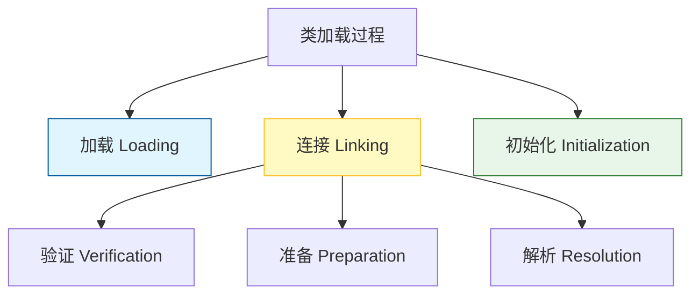

**user**: 面试官问你, 了解类加载机制吗, 该如何回答
[Context: Notes: 面渣/JVM.md]
[Timestamp: 2026/03/22 18:11:05]

**ai**: 基于你当前的 [[JVM]] 笔记，你可以这样简明扼要地回答：

---

**回答示例：**

“是的，我了解。JVM 的主要操作对象就是 Class 文件。所谓的**类加载机制**，就是指 JVM 将 Class 文件中描述的类的数据结构加载到内存中，然后对其进行**校验**、**解析**和**初始化**，最终将其转化为可以被 JVM 直接使用的 Java 类型的过程。”

---

**回答要点解析：**

在回答时，可以拆解为以下几个关键点，以便于面试官理解和记忆：

1.  **对象**：明确 JVM 处理的是 Class 文件。
2.  **动作**：强调是“从文件到内存”的过程（加载到内存中）。
3.  **步骤**：提到核心的三个动作——**校验**（安全性）、**解析**（符号引用转直接引用）、**初始化**（赋值等）。
4.  **结果**：最终变成 JVM 可运行的类型。

**💡 补充建议：**
目前的笔记主要涵盖了类加载的**定义**。在面试中，回答完定义后，面试官通常会追问细节，例如：
-   **类加载的具体过程**（加载、连接、初始化的详细阶段）；
-   **类加载器**（启动类加载器、扩展类加载器、应用程序类加载器）；
-   **双亲委派模型**（什么是双亲委派，为什么要这样设计）。

建议后续可以针对这些高频追问点补充笔记内容。
[Timestamp: 2026/03/22 18:11:27]

**user**: 讲一下类加载过程
[Context: Notes: 面渣/JVM.md]
[Timestamp: 2026/03/22 18:12:31]

**ai**: 类加载过程主要分为三个大阶段：**加载**、**连接** 和 **初始化**。其中连接阶段又细分为：**验证**、**准备**、**解析**。

你可以按照以下逻辑进行回答：

---

**回答示例：**

“类加载过程主要分为三个阶段：**加载**、**连接** 和 **初始化**。

1.  **加载**：
    *   这是“类加载”的第一步。JVM 会通过类的全限定名获取定义此类的二进制字节流（可以从磁盘、网络、zip包等获取）。
    *   将字节流所代表的静态存储结构转化为**方法区**的运行时数据结构。
    *   在**堆**中生成一个代表这个类的 `java.lang.Class` 对象，作为方法区这些数据访问的入口。

2.  **连接**：这个阶段又分为三个子阶段：
    *   **验证**：确保加载的 Class 文件的字节流包含的信息符合当前虚拟机的要求，保证被加载类的正确性，不会危害虚拟机自身安全（如文件格式验证、字节码验证）。
    *   **准备**：为类的**静态变量** 分配内存，并设置**默认初始值**。
        *   *（这里有个面试考点：此时主要设置的是“零值”，比如 `int` 类型默认是 0，`boolean` 默认是 `false`，`static int a = 10` 在这里 `a` 会被赋值为 0，而不是 10。但如果是 `static final` 常量，在这一步就会被赋值为代码中指定的值。）*
    *   **解析**：将常量池内的**符号引用**替换为**直接引用**的过程。简单说就是把“我要调用谁”变成“内存地址在哪里”。

3.  **初始化**：
    *   这是类加载过程的最后一步，也是真正开始执行类中定义的 Java 程序代码。
    *   主要就是执行 `<clinit>()` 方法的过程。
    *   在这个阶段，会对类的静态变量赋予**代码中指定的初始值**（比如上面的 `a` 会在此时变成 10），并执行静态代码块。

---

**总结图示（方便记忆）：**

**💡 补充面试高频追问：**

*   **问：什么时候触发初始化？**
    *   答：主动引用时，比如 `new` 对象、访问静态变量/方法（非常量）、反射调用、初始化子类（父类先初始化）等。
*   **问：准备阶段和初始化阶段给静态变量赋值有什么区别？**
    *   答：准备阶段赋的是系统默认的“零值”；初始化阶段赋的是代码里写的具体值。
[Timestamp: 2026/03/22 18:12:43]