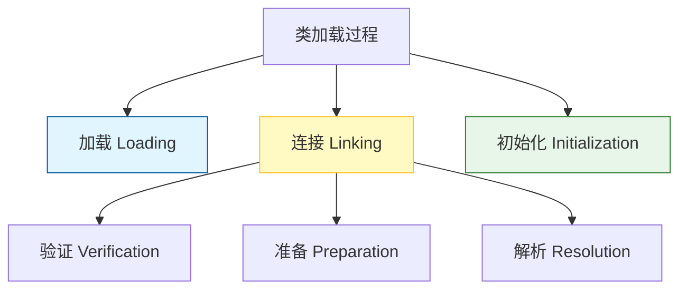

**user**: 面试官问你, 了解类加载机制吗, 该如何回答
[Context: Notes: 面渣/JVM.md]
[Timestamp: 2026/03/22 18:11:05]

**ai**: 基于你当前的 [[JVM]] 笔记，你可以这样简明扼要地回答：

---

**回答示例：**

“是的，我了解。JVM 的主要操作对象就是 Class 文件。所谓的**类加载机制**，就是指 JVM 将 Class 文件中描述的类的数据结构加载到内存中，然后对其进行**校验**、**解析**和**初始化**，最终将其转化为可以被 JVM 直接使用的 Java 类型的过程。”

---

**回答要点解析：**

在回答时，可以拆解为以下几个关键点，以便于面试官理解和记忆：

1.  **对象**：明确 JVM 处理的是 Class 文件。
2.  **动作**：强调是“从文件到内存”的过程（加载到内存中）。
3.  **步骤**：提到核心的三个动作——**校验**（安全性）、**解析**（符号引用转直接引用）、**初始化**（赋值等）。
4.  **结果**：最终变成 JVM 可运行的类型。

**💡 补充建议：**
目前的笔记主要涵盖了类加载的**定义**。在面试中，回答完定义后，面试官通常会追问细节，例如：
-   **类加载的具体过程**（加载、连接、初始化的详细阶段）；
-   **类加载器**（启动类加载器、扩展类加载器、应用程序类加载器）；
-   **双亲委派模型**（什么是双亲委派，为什么要这样设计）。

建议后续可以针对这些高频追问点补充笔记内容。
[Timestamp: 2026/03/22 18:11:27]

**user**: 讲一下类加载过程
[Context: Notes: 面渣/JVM.md]
[Timestamp: 2026/03/22 18:12:31]

**ai**: 类加载过程主要分为三个大阶段：**加载**、**连接** 和 **初始化**。其中连接阶段又细分为：**验证**、**准备**、**解析**。

你可以按照以下逻辑进行回答：

---

**回答示例：**

“类加载过程主要分为三个阶段：**加载**、**连接** 和 **初始化**。

1.  **加载**：
    *   这是“类加载”的第一步。JVM 会通过类的全限定名获取定义此类的二进制字节流（可以从磁盘、网络、zip包等获取）。
    *   将字节流所代表的静态存储结构转化为**方法区**的运行时数据结构。
    *   在**堆**中生成一个代表这个类的 `java.lang.Class` 对象，作为方法区这些数据访问的入口。

2.  **连接**：这个阶段又分为三个子阶段：
    *   **验证**：确保加载的 Class 文件的字节流包含的信息符合当前虚拟机的要求，保证被加载类的正确性，不会危害虚拟机自身安全（如文件格式验证、字节码验证）。
    *   **准备**：为类的**静态变量** 分配内存，并设置**默认初始值**。
        *   *（这里有个面试考点：此时主要设置的是“零值”，比如 `int` 类型默认是 0，`boolean` 默认是 `false`，`static int a = 10` 在这里 `a` 会被赋值为 0，而不是 10。但如果是 `static final` 常量，在这一步就会被赋值为代码中指定的值。）*
    *   **解析**：将常量池内的**符号引用**替换为**直接引用**的过程。简单说就是把“我要调用谁”变成“内存地址在哪里”。

3.  **初始化**：
    *   这是类加载过程的最后一步，也是真正开始执行类中定义的 Java 程序代码。
    *   主要就是执行 `<clinit>()` 方法的过程。
    *   在这个阶段，会对类的静态变量赋予**代码中指定的初始值**（比如上面的 `a` 会在此时变成 10），并执行静态代码块。

---

**总结图示（方便记忆）：**

**💡 补充面试高频追问：**

*   **问：什么时候触发初始化？**
    *   答：主动引用时，比如 `new` 对象、访问静态变量/方法（非常量）、反射调用、初始化子类（父类先初始化）等。
*   **问：准备阶段和初始化阶段给静态变量赋值有什么区别？**
    *   答：准备阶段赋的是系统默认的“零值”；初始化阶段赋的是代码里写的具体值。
[Timestamp: 2026/03/22 18:12:43]

**user**: - 讲一下类加载的过程: 类加载的过程分为三个阶段, 分别是载入, 连接和初始化
		- 载入就是将类的二进制字节码加载到内存里面
		- 连接分为三个小的阶段, 分别是验证, 准备和解析
			- 验证是检查类文件是否符合JVM的规范
			- 准备就是为类中的静态变量分配空间并且设置默认值
			- 解析就是把常量池里面的符号引用替换为直接引用
		- 初始化阶段会执行静态代码块和静态变量的初始化, 就是把代码里面的值赋值给静态变量         我这个过程可以吧, 回答这个的话
[Context: Notes: 面渣/JVM.md]
[Timestamp: 2026/03/22 18:21:22]

**ai**: 这个回答**完全可以**！逻辑清晰，覆盖了核心考点，面试官听到这样的回答是满意的。

如果满分是 10 分，这个回答能拿到 **8.5 分**。它清晰地划分了阶段，并且准确描述了每个阶段做了什么，特别是区分了“准备阶段”的默认值和“初始化阶段”的代码赋值，这一点非常关键。

如果你想把这个回答升级到 **10 分**（展示更扎实的功底），可以在你现有的基础上微调两个小细节：

### 💡 升级建议（加粗部分是建议补充的内容）

1.  **在“准备”阶段补充特例**：
    *   你的原话：“准备就是为类中的静态变量分配空间并且设置默认值”
    *   **升级后**：“准备就是为类中的静态变量分配空间并且设置默认值。**这里要注意一个特例，如果是 `static final`（常量），在准备阶段就会被赋值为代码中指定的值，而不是默认值。**”
    *   *理由：防止面试官追问：“所有静态变量都是默认值吗？”*

2.  **在“初始化”阶段加上专业术语**：
    *   你的原话：“初始化阶段会执行静态代码块和静态变量的初始化”
    *   **升级后**：“初始化阶段会执行类构造器 `<clinit>()` 方法，**这个过程会合并执行静态代码块中的语句和静态变量的赋值操作。**”
    *   *理由：提到 `<clinit>()` 方法会让面试官觉得你对底层的字节码执行过程很熟悉。*

---

### 综合后的“满分”话术参考：

> “类加载的过程主要分为三个阶段：**载入、连接和初始化**。
>
> 首先是**载入**，简单来说就是将类的二进制字节码读取到内存中。
>
> 然后是**连接**阶段，它又分为三小步：
> 1. **验证**：检查加载的类文件是否符合 JVM 规范，确保安全；
> 2. **准备**：为类的静态变量分配内存并设置**默认初始值**（比如 int 是 0），**但如果是 `static final` 常量，在这一步就会直接赋值为代码指定的值**；
> 3. **解析**：把常量池中的符号引用替换为直接引用（也就是内存地址）。
>
> 最后是**初始化**阶段，这是类加载的最后一步，JVM 会开始执行类构造器 **`<clinit>()` 方法**，真正去执行静态代码块里的逻辑，以及把代码里显式写的值赋给静态变量。”

这样回答既有条理，又踩到了潜在的陷阱点，非常稳！
[Timestamp: 2026/03/22 18:21:35]

**user**: 双亲委派模式是什么？为什么使用这种模式？
[Context: Notes: 面渣/JVM.md]
[Timestamp: 2026/03/22 18:22:59]

**ai**: 这也是 JVM 类加载机制中非常核心的高频面试题。你可以这样回答：

---

### 1. 双亲委派模式是什么？

**回答逻辑：**

“如果一个类加载器收到了类加载的请求，它首先不会自己去尝试加载这个类，而是把这个请求**委派给父类加载器**去完成，每一个层次的类加载器都是如此。

因此所有的加载请求最终都应该传送到最顶层的**启动类加载器**（Bootstrap ClassLoader）中。只有当父加载器反馈自己无法完成这个加载请求（它的搜索范围中没有找到所需的类）时，子加载器才会尝试自己去加载。”

**层级结构（从上到下）：**
1.  **启动类加载器**：加载 Java 核心库（如 `rt.jar`）。
2.  **扩展类加载器**：加载扩展目录（`ext` 目录）中的类。
3.  **应用程序类加载器**：加载用户类路径上的类。

---

### 2. 为什么使用这种模式？

主要有两个核心原因：

**1. 安全性（防止核心 API 被篡改）：**
这是最主要的原因。通过双亲委派，Java 核心类（如 `java.lang.String`）总是由启动类加载器加载。
-   *例子*：如果你自己写了一个 `java.lang.String` 类，如果没有双亲委派，应用程序类加载器可能会加载你写的类，导致系统混乱。
-   *结果*：有了双亲委派，JVM 会一直向上委托到启动类加载器，发现它已经加载了 JDK 自带的 `String`，就会直接使用，忽略你写的类。这样保证了 Java 核心库的安全性和稳定性。

**2. 避免重复加载：**
如果父加载器已经加载过了该类，子加载器就没必要再加载一次，保证了类在内存中的唯一性，节省了内存空间。

---

### 💡 答题模板（可以直接背）：

“双亲委派模型是指：当一个类加载器收到加载请求时，它首先不会自己去尝试加载，而是将请求委派给父类加载器，只有当父加载器无法完成时，子加载器才会尝试加载。

使用这种模式主要有两个原因：
第一是**安全性**，它可以保证 Java 核心类库（如 `java.lang.String`）不被篡改，始终由顶层的启动类加载器加载；
第二是**避免重复加载**，使得类在内存中保持唯一性，提高了效率。”

---

**🎯 进阶追问（如果想加分可以准备）：**
*   **Q: 双亲委派模型被打破过吗？**
*   **A:** 打破过。例如 **Tomcat** 类加载机制（为了实现不同应用依赖不同版本的 jar 包互不干扰），还有 **JDBC**（SPI 机制，需要由启动类加载器加载接口，但具体的实现类是由厂商提供的，需要线程上下文类加载器去打破双亲委派来加载）。
[Timestamp: 2026/03/22 18:23:18]