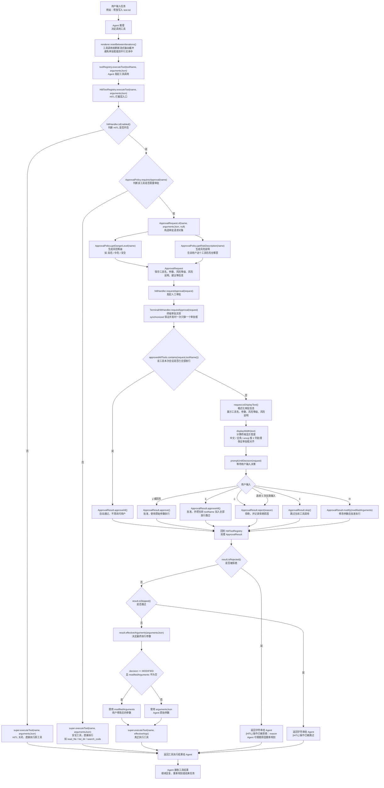

**user**: 帮我把这里面的这个图缩小一点
[Context: Notes: PaiCLI/HITL.md]
[Timestamp: 2026/05/14 22:38:16]

**ai**: 可以，最简单是在 Mermaid 图开头加一个 `init` 配置，调小字体和节点间距。

把你现在的开头：

```mermaid
flowchart TD
```

改成：

```mermaid
%%{init: {"themeVariables": {"fontSize": "12px"}, "flowchart": {"nodeSpacing": 20, "rankSpacing": 30}} }%%
flowchart TD
```

也就是变成这样：



如果你还想再小一点，可以把：

```json
"fontSize": "12px"
```

改成：

```json
"fontSize": "10px"
```

同时把：

```json
"nodeSpacing": 20, "rankSpacing": 30
```

改成：

```json
"nodeSpacing": 15, "rankSpacing": 20
```
[Timestamp: 2026/05/14 22:39:22]