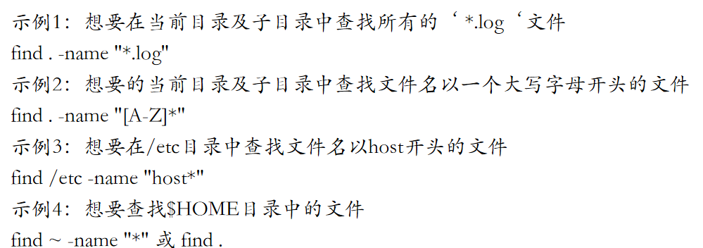
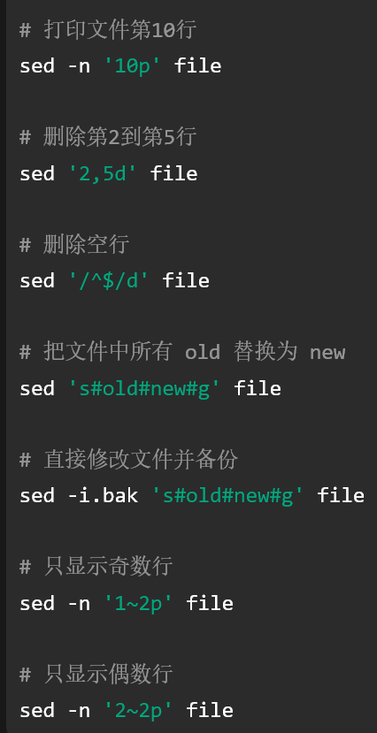
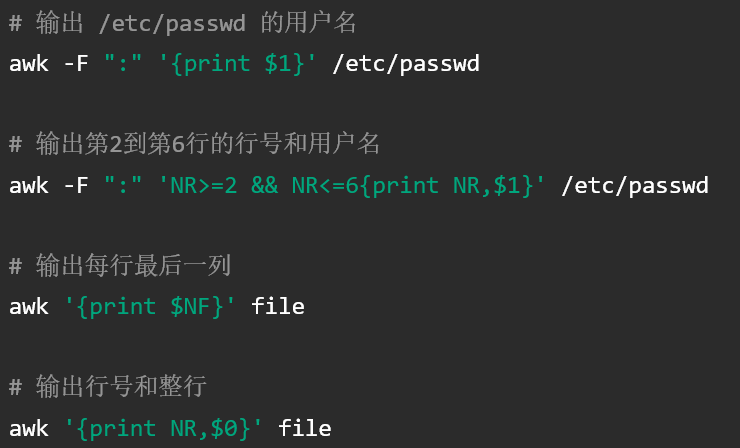
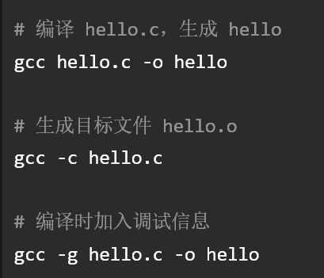

1. Linux内核版本和发行版的关系: 
	1. 内核版本形式为A.B.C(eg: 2.4.2), A为主版本号, B为次版本号, 二者共同构成了当前内核版本号, C表示对当前版本的修订次数
	   **约定**: 次版本号为奇数时, 不一定稳定; 偶数时稳定. ==不过==, 3.0版本之后次版本号没有奇数和偶数之分, 都表示稳定版本
	2. 主要发行版本像: 
	   
	   
2. 操作系统的基本功能: 包括存储管理, 进程和处理机管理, 文件管理, 设备管理, 用户接口, 
3. 修改命令提示符的方法: PS1="$", PS1="可以填你自定义的", 像 
   PS1="\w -> ", 效果为: `~/Documents ->`
   
4. 文件名通配符: 
	1. *  与0个或任意多个字符匹配, .* 只与隐含文件匹配
	2. ?  与单个的任意字符匹配
	3. [] 可以是[123]或者[1-3], 与括号内的任意一个字符匹配, 如果以 ! 或者 ^ 开头, 意思就是不与[]内部的字符匹配
5. 正则表达式: 常用于 grep/sed/awk等文本匹配`. 任意单个字符; [] 指定范围内一个字符; [^] 指定范围外; * 前一个字符重复0次或多次 ^ 行首; $ 行尾; ^$ 空行; .* 任意长度任意字符; 
6. shell脚本的第一行一定是: #!/bin/bash
7. head -n 文件 显示某文件的前n行; tail类似.  默认10行都是; more: 分页显示, 只能比较基础的翻页,  空格, 下一屏; 回车 下一行; b 上一屏; q 退出; less: 比more强一点, 可以前后翻页
8. `grep '^\*' file 查找以*打头的行`, 单引号意思是把引号中的内容交给grep去处理, ^在正则表达式里代表它接下来的字符必须在一行的开头, 然后是*, 因为 * 特殊的, 所以要加转义字符/, /* 表示 * ; sort 默认升序, sort -r 可以降序, `sort -n -t : -k 2 facebook.txt, 它的意思是-n, 按数值排序, -t指定分割符为: , 然后文本内容被分割开了, -k 2指定了排序的字段为第2列`; uniq只处理相邻的重复行, 如果不相邻 就不能去除, 所以一般使用会先sort再uniq
9. cp, 如果是目录, 要加 -r, -i可以交互式, 比如 `cp  mfile  /home/mengqc/exam1` 你要复制文件, 如果exam1不存在, 那么就创建文件重命名; 如果存在并且有内容, 那么会静默覆盖, 如果有-i参数会提示你是否有覆盖, 输入y就覆盖; cp复制目录要加-r
10. rm默认不能删除目录, -r递归式的删除指定目录及其下属; -i交互式; -f强制删除不提示
11. mv, 如果源文件和目标文件在同一目录下, 就是重命名, `mv a.txt b.txt`, 把a.txt改名为b.txt; 如果在不同目录下, 就移动文件, 像 `  mv a.txt /home/packb/`把a.txt移动到这个目录下, `mv a.txt /home/packb/c.txt`这样的移动完还要重命名
12. wc, 输出格式为 `行数 字数 字节数 文件名`, -l 行数, -w 单词数, -c 字节数, -m 字符数
13. paste, 按列合并文件, 字面意思, -d用来指定分隔符, 默认为空格, -s串行处理
14. find, 
    
15. > , 重定向输出, 如果有东西会清空; >> 这个是追加, <<这个的意思是从下一行开始读取输入, 直到遇到指定的结束标记, 比如`cat << EOF > file.txt` 就是重定向输出到file.txt文件中, 直到碰到EOF才停止
16. Linux目录的作用
	1. /etc: 存放系统配置文件, 比如/etc/passwd 用户账户信息; /etc/group 用户组信息; /etc/shadow用户密码影子文件, 通常只有root可读, 放加密密码信息
	2. /bin: 存放普通用户的命令, Linux常用命令
	3. /sbin: 存放系统管理命令, 给root用
	4. /dev: **设备**文件目录, /dev/null 黑洞设备, 写入的数据会丢失
	5. /home: 普通用户主目录的基础目录
17. 绝对路径和相对路径: 绝对路径: 从根目录 / 开始, 相对路径从当前工作目录开始
	1. 可能考题: 当前目录为 /home/user/test，访问 /home/user/file.txt 的相对路径是什么？
	2. 答案: ../file.txt
18. 文件和目录权限: 
	1. u 文件主 user; g 同组用户 group; o 其他用户 other; a 所有用户 all
	2. 文件: r 读权限, w 写权限, x 执行权限
	3. 目录: 如果目录没有x权限, 那么即使知道文件名, 也无法进入或者访问
	4. ls -l 做出权限解释: -rwxr-xr-x.  意思是-代表普通文件, rwx所有者有三种权限, r-x 同组用户读+执行, r-x 其他用户读+执行
	5. r=4, w=2, x=1
19. mkdir 和 rmdir: 
	1. mkdir: -p父目录不存在时一并创建; -m创建时指定权限
	2. rmdir: 删除空目录的, 不能删除当前的工作目录和它的子目录. -p会在删除子目录后如果父目录也为空, 会一起删除
20. 硬链接和软连接: 
	1. 硬链接: 通过ln, 硬链接与原文件共享同一个inode, 不能对目录做硬链接, 删除原文件后, 只要还有硬链接存在, 文件数据就在
	2. 软链接: 通过ln -l, 软链接里面保存的是原文件的地址, 原文件被删了也就不能用了, 它有自己的inode, 可以链接目录, 可以跨文件系统
21. chmod: `chmod a+x ex1, chmod o-r file, chmod u=rw,g=r,o= file`
22. umask: 用来设置新建文件或目录文件的默认权限掩码. `目录最大权限：777, 普通文件最大权限：666, umask则是去掉权限, 比如umask 022, 创建目录默认权限为: 777-022=755, 创建文件默认权限为: 666-022=644`
23. chgrp 和 chown: 
	1. chgrp: 修改文件所属用户组
	2. chown: 修改文件主 或者 文件主+用户组
	3. 例题: 
		1. **将 file 的所有者改为 tom：chown tom file**
		2. **将 file 的所属组改为 students：chgrp students file**
		3. **将目录 /data 及其所有内容所有者改为 tom：chown -R tom /data**, -R就是递归处理目录及其子目录文件
24. ps: Linux标准的进程查看工具
25. kill: kill本质是向进程发送信号. kill -9是强制结束
26. df: 查看文件系统磁盘使用清空
27. tar: 是打包命令. -c: 创建文档; -x: 解包; -t: 查看包内容; -f: 指定文件名; -z: 使用gzip; -v: 显示过程  `c/x/t三者只能选一个, -f后面紧跟文件名`
	1. 例子: 
		1. 打包并 gzip 压缩:  tar -zcvf archive.tar.gz dir
		2. 查看 tar.gz 内容:   tar -ztvf archive.tar.gz
		3. 解压 tar.gz:          tar -zxvf archive.tar.gz
28. sed: 默认不修改原文件, -i才直接修改
    
29. awk: `$0:整行; $1:第1列; $NF:最后一列; NR:当前行`
    
30. vi的工作模式: 进入vi后默认命令模式, 按i`(光标前插入)`/a`(光标后追加)`/o`(当前行下新开一行)`进入插入模式; 插入模式按ESC回到命令模式; 命令模式按 : 进入Ex模式(转义/末行模式) 
	1. 退出: :w保存;  :q退出, 要求文件未修改;  ZZ和 :wq 类似, 不过ZZ如果未修改文件的话不会更新文件时间戳;  :x类似ZZ;  :q! 不保存退出
	2. 光标移动: 左: h;; 下: j 上: k; 右: l
31. gcc: -g加入调试信息供gdb使用; -c只生成 .o , 不链接. 
    **预处理->编译->汇编->链接**
    
```
	2. 定向输出, eg: echo "It is a test" > myfile
	3. 单引号: echo '$name\"',  原样输出单引号中的内容, 即字符串, $name\". 同时单引号内部不能再有单引号
	4. 双引号: 比如 name="Linux", echo "Hello $name", 输出为Hello Linux. 即$用于变量替换. 它有三个$, `, \, 会保留各自的特殊含义
	5. $() 和 反引号 ` 的作用完全一样, 都是命令替换, 就是把括号里的命令运行完拿出来再往下运行. eg: today=$(date +%Y-%m-%d) echo "今天是 $today"
	6. su -, 普通用户到超级用户; su - 用户名, 可以从超级用户到普通用户. 当然, exit也是可以的
	7. .代表目录本身, ..代表该目录的父目录
```


