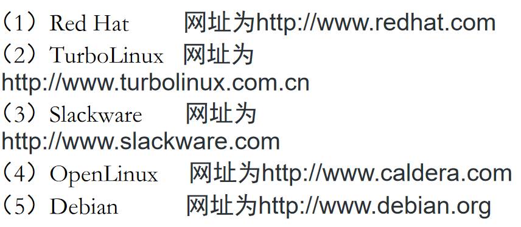
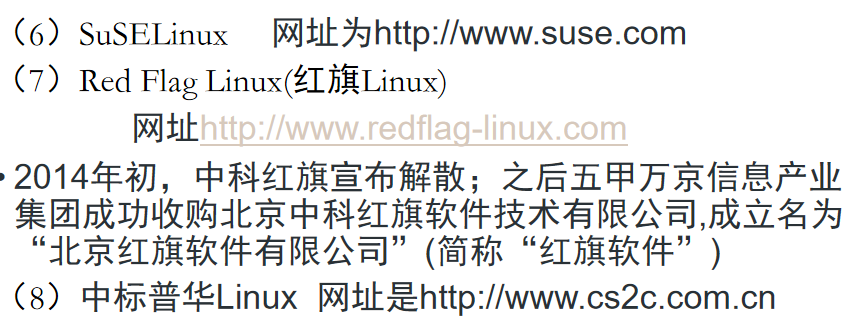
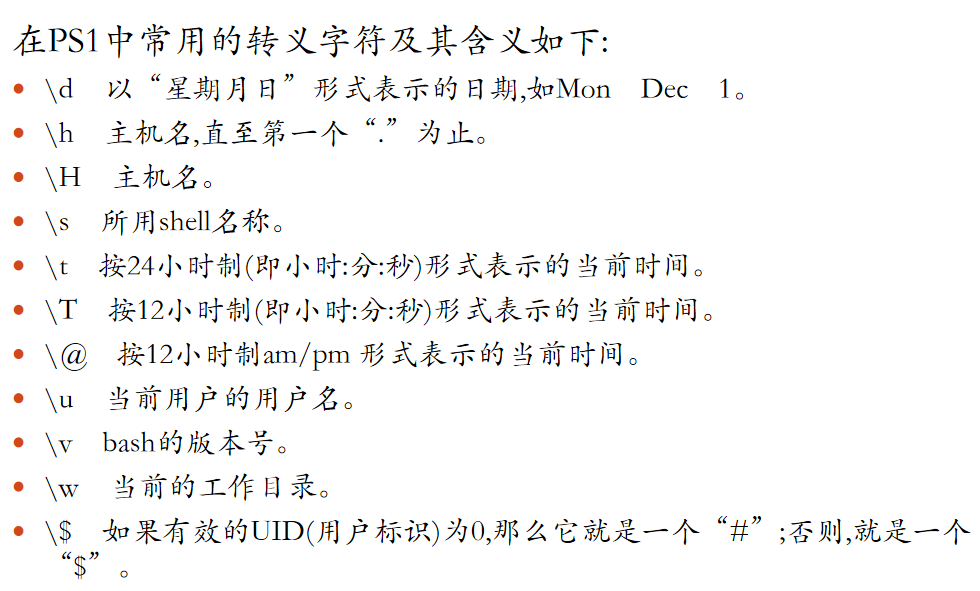

1. Linux内核版本和发行版的关系: 
	1. 内核版本形式为A.B.C(eg: 2.4.2), A为主版本号, B为次版本号, 二者共同构成了当前内核版本号, C表示对当前版本的修订次数
	   **约定**: 次版本号为奇数时, 不一定稳定; 偶数时稳定. ==不过==, 3.0版本之后次版本号没有奇数和偶数之分, 都表示稳定版本
	2. 主要发行版本像: 
	   
	   
2. 操作系统的基本功能: 包括存储管理, 进程和处理机管理, 文件管理, 设备管理, 用户接口, 
3. 修改命令提示符的方法: PS1="$", PS1="可以填你自定义的", 像 
   PS1="\w -> ", 效果为: _`~/Documents ->`_
   
4. 
	```
	1. 定向输出, eg: echo "It is a test" > myfile
	2. 单引号: echo '$name\"',  原样输出单引号中的内容, 即字符串, $name\". 同时单引号内部不能再有单引号
	3. 双引号: 比如 name="Linux", echo "Hello $name", 输出为Hello Linux. 即$用于变量替换
	4. $() 和 反引号 ` 的作用完全一样, 都是命令替换, 就是把括号里的命令运行完拿出来再往下运行. eg: today=$(date +%Y-%m-%d) echo "今天是 $today"
	```


