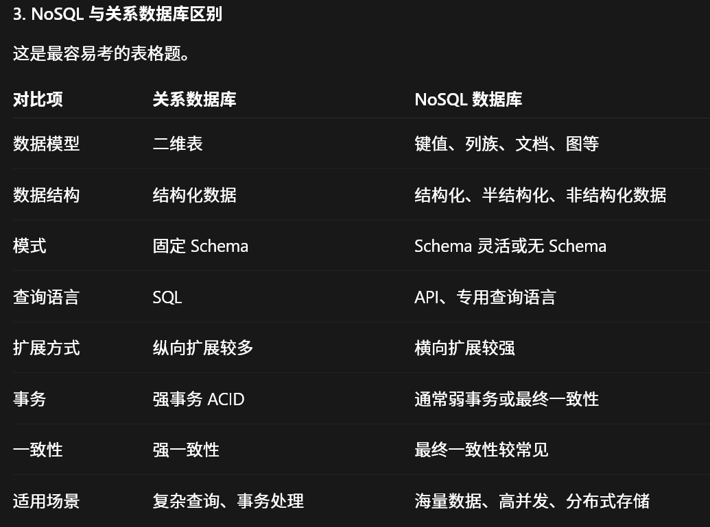

# 1 大数据概述
1. 第三次信息化浪潮的标志性产物: 大数据, 云计算 和 物联网; 发生在2010年前后; 解决的问题: 信息爆炸
2. 大数据的4V: 数据量大, 数据类型繁多, 处理速度快 和 价值密度低
3. 大数据的影响: 
	   1. 大数据对科学研究的影响: 大数据使得人类的科学研究在经历实验科学, 理论科学, 计算科学3种范式后, 迎来了第4种范式---数据密集型科学
	   2. 大数据对思维的影响: 思维方式的三种转变, 全样而非抽样, 效率而非精确, 相关而非因果
	   3. 大数据对社会发展的影响: 大数据对社会发展产生了深远的影响, 具体表现在大数据决策成为一种新的决策方式; 大数据成为促进国家发展的新工具; 大数据开发推动新技术和新应用不断涌现
4. **简答题**: 大数据与云计算, 物联网的关系
   大数据, 云计算和物联网代表了IT领域最新的技术发展趋势, 三者既有区别又有联系
   (1)大数据, 云计算和物联网的区别. 大数据侧重对海量数据的存储, 处理与分析, 从海量数据中发现价值; 云计算旨在整合和优化各种IT资源, 并通过网络以服务的方式廉价地提供给用户; 物联网的发展目标是实现"物物相连"
   (2)联系. 整体上看是相辅相成的.大数据根植于云计算, 大数据分析的很多技术都来自云计算, 云计算的分布式数据存储和管理系统提供了海量数据的存储和管理能力, 分布式并行处理框架MapReduce提供海量数据分析能力. 反之, 大数据为云计算提供了"用武之地". 物联网是大数据重要的数据来源. 
# 2 大数据处理架构Hadoop
1. HDFS的特性: HDFS具有处理超大数据集, 支持流式处理, 可以在廉价商用服务器上等优点. 
   因此它的吞吐率高, 适合作为超大数据集的底层**数据存储系统**
2. HBase: 一个具有高可靠性, 高性能, 可伸缩, 实时读写等特性的分布式数据库; 与传统数据库的关系: HBase采用基于列的存储, 传统基于行的存储; 它具有良好的横向扩展能力, 可以通过不断增加廉价的服务器来提高存储能力
3. MapReduce: 核心思想: 分而治之. 就是把输入的数据集切分成若干独立的数据块, 分发给一个主节点下的各个分节点来完成, 通过整合各个分节点的结果来得到最终结果
4. Hadoop: 
	1. 单机: 就是Hadoop只在一台机器上运行, 数据存储采用本地文件系统, 没有采用分布式文件系统HDFS
	2. 伪分布式: 存储使用HDFS, 但是名称节点和数据节点 `(逻辑节点, 可以有多个)` 都在同一台机器 `(物理节点, 只有一个)` 上
	3. 真分布式: Hadoop的存储采用分布式文件系统HDFS, 并且HDFS的名称节点和数据节点位于集群的不同机器上
	4.  名称节点和数据节点: 名称节点用来管理元数据的, 数据节点是实际上的工作节点, 负责实际存储和检索数据块
	5. 伪分布式启动后的进程有: NameNode, SecondaryNameNode, DataNode
# 3 分布式文件系统HDFS
1. 分布式文件系统在物理结构上是由计算机集群的多个节点构成的. 分为两类: 一类是主节点, 也叫名称节点; 另一类是从节点, 也叫数据节点
2. **名称节点**负责文件和目录的创建, 删除和重命名, 同时管理数据节点和数据块的映射关系(所以要先访问名称节点才能找到数据块); **数据节点**负责数据的存储和读取. 
   具体来说, **在存储时**, 名称节点先为数据分配存储位置, 然后客户端把数据写入响应的数据节点; **在读取时**, 客户端从名称节点获取数据节点和数据块的映射关系, 找到数据块的位置
3. 数据块是文件存储的基本单位, 数据块存储在数据节点上面
4. ==HDFS的特性==: 
	1. 兼容廉价的硬件设备
	2. 支持流数据读写
	3. 支持大数据集
	4. 采用简单的文件模型
	5. 强大的跨平台兼容性
	 **局限性**: 
		 1. 不适合低延迟的数据访问. 因为它主要是面向大规模的数据批量处理而设计的, 采用流式读取的方式, 具有高吞吐率, 但是这代表它的延迟会较高
		 2. 无法高效存储和处理大量小文件
		 3. 不支持多用户写入及任意修改文件. 就是只能一个文件只能有一个写入者, 而且只支持追加写
5. 使用数据块的好处: 支持大规模的文件存储; 简化了系统的设计; 降低了节点的寻址开销; 适合数据备份(因为每个数据块可以存储在多个节点上面)
6. ==名称节点详细版==: 就是在HDFS中, 名称节点用来管理分布式文件系统的命名空间及客户端对文件的访问, 它保留了两个核心文件, 分别叫做 `FsImage` 和 `EditLog` 文件.     F这个文件用于维护文件系统树和树上所有文件和文件夹的元数据, E这个文件中记录了所有对文件的创建, 删除, 重命名等操作. 名称节点记录了每个文件中各个数据块所在的数据节点的位置, 会在系统每次启动时扫描所有的数据节点重构.
   具体来说就是名称节点启动时, 会把F中的内容加载到内存中, 然后执行E中的操作, 使得内存中的数据最新. 完成这个操作后, 会创建一个新的F文件 和 一个空的E文件. 当名称节点启动成功后, HDFS中的更新操作都会被写入新的E文件中, 而不会写到F文件中. 这是因为E文件的大小远远小于F文件, 更新操作写入是很高效的.
   `名称节点在启动期间是出于安全模式, 只能对外提供读操作, 不能提供写操作, 启动过程结束后, 系统会退出安全模式, 进入正常的运行状态, 对外提供读写操作`
   ==第二名称节点==
   在运行期间, HDFS会不断产生更新操作, 都被写入到E文件中, E文件逐渐变大, 虽然在名称节点运行期间不会产生影响, 但是当名称节点重启时要重新执行E文件中的记录, 使得这个过程会很缓慢, 导致名称节点长期处于安全模式, 影响用户使用
   为了解决这个问题, 采用了第二名称节点, 它有两个作用: 
	1. 是完成E文件和F文件的合并操作, 减少E文件的大小, 缩短名称节点重启时间
	2. 可以作为名称节点的检查点, 保存名称节点中的元数据信息
	具体来说就是: 
	(1) 合并: 每隔一段时间, 第二名称节点就会请求名称节点暂停使用E文件, 把新达到的写操作添加到一个新文件E.new中, 然后把名称节点的F文件和E文件拉到本地进行合并(`合并操作就是前面的重新执行E文件中的记录来更新F文件`)操作生成一个新文件F.ckpt, 生成后把新文件发送给名称节点用来替代它现在的F文件, 用E.new替代它的E文件, 从而减小了E文件的大小
	(2) 检查点: 就是第二名称节点会把名称节点的F和E文件拉到本地进行合并成一个新的F文件, 这就相当于第二名称节点在周期性的备份名称节点中的元数据信息, ==名称节点发生故障就可以用第二名称节点中记录的元数据信息进行恢复==, 不过仍然可能会丢失部分数据如果故障的时间发生在刚把名称节点的F和E文件拉到本地合并的那段时间. 所以它不能起到热备份的作用
7. HDFS的存储原理: 数据的冗余存储, 数据存取策略 和 数据错误与恢复
	1. 数据冗余存储: 就是一个数据块会被备份到多个数据节点上面
	2. 数据的存取策略: 包括数据存放, 数据读取 和 数据复制
		1. (**主要看这个就行**)数据存放: HDFS默认冗余复制因子为3. 第1个和第2个副本放在同一个机架的不同机器上, 第3个副本放在不同机架的机器上(`一个HDFS包含多个机架, 一个机架中有多个数据节点`)
		   还有就是, 如果在集群内发起写请求, 就把第1个副本放到发起写请求的数据节点上面, 如果是集群外的话, 那么就从集群内找一个磁盘空间充足, CPU较不忙的数据节点存放; 后面的第2, 3个副本被放到与第1个副本不同机架的同一个机架的不同数据节点上面(`就是2, 3一个机架, 1一个`)
	3. ==数据错误与恢复==: HDFS容错性高, 可以兼容廉价的硬件设备, 它把硬件出错看成是常态, 并且有设计自动恢复机制, 硬件出错包括下面3种情形: 
		1. 名称节点出错: 名称节点保存了所有的元数据信息, 损坏的话HDFS实例就会失效. 有两种机制保证名称节点的安全, 1. 是把名称节点上的元数据信息同步存储到其他文件系统(比如远程挂载的网络文件系统) 2. 运行一个第二名称节点, 名称节点死机后, 可以**运行**第二名称节点(缺点是可能会丢失部分数据) 3. 一般会结合使用, 名称节点死机, 到远程挂载的NFS种获取备份的元数据信息, 把元数据信息放到第二名称节点上进行恢复, 并把第二名称节点当成名称节点去使用
		2. 数据节点出错: 数据节点会定期向名称节点发送"心跳"信息, 如果名称节点收不到, 就会被标记为"死机". 这时就会因为某些数据节点不可用导致了某些数据块的副本数量小于冗余复制因子. 
		   解决办法: 名称节点会定期检查这种情况是否出现, 如果出现就启动数据冗余复制, 为该数据块生成新的副本
		   `HDFS和其他分布式文件系统最大区别就是可以调整冗余数据的位置`
		3. 数据出错: 通过MD5或者SHA-1去校验, 校验出错客户端会请求另外一个数据节点, 并且向名称节点报告这个数据块有错误, 名称节点会定期检查并重新复制这个数据块
8. 写数据的过程
	1. 客户端调用FileSystem.create()创建文件, 
# 4 分布式数据库HBase
1. HBase和传统关系数据库的区别: 关系数据库具备面向磁盘的存储和索引结构, 多线程访问, 基于锁的同步访问机制, 基于日志记录的恢复机制和事务机制
	1. 数据类型: 关系数据库采用关系数据模型, 具有丰富的数据类型和存储方式,HBase采用更简单的数据模型
	2. 数据操作: 关系数据库提供了丰富的操作, 像插入, 删除等等, 其中会涉及复制的多表连接; HBase的操作不存在复杂的表与表之间的关系
	3. 存储模式: 关系数据库基于行存储的, HBase基于列存储的
	4. 数据索引: 关系数据库可以构建复杂索引, HBase只有一个索引---行键
	5. 数据维护: 关系数据库, 更新操作会覆盖原值; HBase中更新操作会保留旧版本
	6. 可伸缩性: 关系数据库很难实现横向扩展, 纵向扩展空间也有限; HBase则是为了实现灵活的横向扩展而开发的
2. HBase是一个稀疏, 多维度, 有序的映射表, 索引包括行键, 列族, 列限定符 和 时间戳
	1. 行键; 访问方式有三种, 分别是通过单个行键访问; 通过一个行键的区间来访问; 全表扫描
3. 先问 ZooKeeper 找 ROOT，
   再问 ROOT 找 META，
   再问 META 找用户 Region，
   最后访问 RegionServer。
4. Region服务器的工作原理: 
	1. 用户读写数据的过程: 
		1. 用户写数据时, 相关操作会被分配到Region服务器去执行, 用户数据会先被写入MemStore(内存中的缓存, 保存最近更新的数据)和HLog中, 写入HLog后, commit()调用才会将其返回给客户端
		2. 用户读数据时会先去MemStore中读取, 如果没有, 那么就去磁盘上面的StoreFile去寻找
	2. MemStore缓存的刷新: 
		1. 因为MemStore容量有限, 所以系统会周期性的把MemStore中的内容写入磁盘的StoreFile文件中来清空MemStore缓存, 并在HLog中写入一个标记, 代表缓存中的内容已经被写入StoreFile中. 这里的StoreFile文件是新生成的, 所以每个store会包含多个StoreFile文件
		2. 每个Region服务器都有属于自己的HLog文件, 启动时, 每个Region都会检查HLog是否更新, 确认最近一次缓存刷新操作后是否有新的写入操作. 
		   如果没有, 说明数据全被保存到了磁盘; 如果有, 就先把更新写入MemStore缓存中, 然后刷新缓存吸入磁盘. 
		   最后删除旧的HLog文件, 为用户提供服务
	3. StoreFile的合并: 因为每次的缓存刷新都会在磁盘上生成一个新的FileStore文件, 这样旧导致该文件数量多, 查找耗时, 所以系统一般会调用Store.compact()把多个StoreFile文件合并为一个大文件. `(因为合并操作耗费资源, 所以只有在StoreFile文件的数量达到一个阈值才会触发合并操作)`
# 5 NoSQL数据库
1. 是非关系型数据库的统称. 支持横向(水平)扩展, 海量数据存储. 还支持MapReduce风格编程, 具有灵活的数据模型. 最后它与云计算紧密融合
2. NoSQL数据库出现的原因: 
	1. 无法满足海量数据的管理需求
	2. 无法满足数据高并发的需求
	3. 无法满足高可扩展性和高可用性的需求
3. 
4. NoSQL数据库的四大类型: 
	1. 键值数据库: Redis, 缓存, 会话. 可扩展性好, 灵活度高; 无法存储结构化信息
	2. 列族数据库: HBase, 日志, 海量稀疏数据. 可扩展性好, 查找速度块; 功能少, 大都不支持强事务一致性
	3. 文档数据库: MongoDB, JSON文档. 性能好, 灵活度高; 缺乏统一的查询语言
	4. 图数据库: Neo4j, 社交网络. 灵活度高, 可构建复杂的关系图谱; 复杂度高
5. 三大基石: CAP, BASE, 最终一致性
	1. CAP: 
		1. C: 一致性. 分布式环境下, 各个节点的数据是一致的
		2. A: 可用性. 快速获取数据, 且在确定时间内返回操作结果
		3. P: 分区容错性. 出现网络分区时, 分离的系统仍可以运行
		4. CA: 一致性+可用性. 比如传统MySQL, 可扩展性差
		5. CP: 一致性+分区容错性. HBase, Neo4j. 就是出现网络分区时, 受影响的服务要等待数据一致
		6. AP: 可用性+分区容错性. Dynamo. 允许返回的数据不一致
		分布式系统中必须保证P, 通常在C和A中选择
	2. BASE: 牺牲了高一致性, 获得了可用性.(NoSQL中用来替代ACID的思想)
	   BASE的基本含义是基本可用, 软状态(可用有一段时间不同步, 具有一定的滞后性)和最终一致性(属于弱一致性)
	3. 最终一致性: 就是没有更新操作时, 经过一段时间后, 所有的副本最终会达到最终一致性
	   N: 数据复制的份数; W: 更新数据时需要保证写完成的节点数; R: 读取数据时需要读取的节点数
	   如果W+R>N, 强一致性;  W+R<=N, 弱一致性; N=W=R=1, 任何一个写节点失效, 都会导致写失效, 可用性较低
# 7 MapReduce
1. Map, Reduce函数: Map 阶段：局部处理，生成中间键值对; Reduce 阶段：按 Key 汇总value的集合，生成最终结果.
   都以<key, value>(键值对)作为输入和输出
   Map任务的输入文件, Reduce任务的处理结果都是保存在**分布式文件系统**中的, 而Map任务的中间结果是保存在**本地存储设备(像磁盘)** 中
2. MapReduce工作流程: 
	1. MapReduce框架使用InputFormat模块进行Map前的预处理, 然后对输入文件进行逻辑切片为多个InputSplit. `(这里并没有对文件进行了实际切分, 而是记录了要处理数据的位置和长度)`
	2. RecordReader(RR)进行物理切分, 将其转换为适合Map任务读取的键值对, 输入给Map任务
	3. Map函数处理, 输出<key, value>作为中间结果
	4. 对Map的输出进行分区, 排序, 合并, 归并等操作, 得到<key, value-list>这样的形式 , 交给Reduce去处理`(这个过程叫做Shuffle)`
	5. Reduce函数处理, 输出结果交给OutputFormat模块
	6. OutputFormat模块验证输出目录是否存在以及输出结果类型是否符合配置文件中的配置类型, 如果都满足, 就把结果输出到分布式文件系统
3. Shuffle过程: 就是对Map的输出结果进行分区, 排序, 和并, 归并等操作并交给Reduce的过程
	1. Map端的Shuffle过程: Map输出结果首先被写入缓存, 缓存满后就启动溢写操作, 把缓存中的数据写到磁盘中清空缓存. 启动溢写操作时, 要先对缓存中的数据进行分区, 然后对每个分区中的数据进行排序和合并操作, 然后再写入磁盘. 每次的溢写操作都会生成一个新的溢写文件, 随着Map任务的执行, 磁盘中会有很多个溢写文件. 在Map任务结束之前, 会对溢写文件进行归并为一个大的溢写文件, 然后通过响应的Reduce任务来领取自己要处理的数据
	2. Reduce端的Shuffle过程: Reduce任务从Map端的不同Map机器领取自己要处理的那部分数据, 然后将数据归并并进行处理
# 8 Hadoop再探讨
1. Hadopp1.0, 仅针对MapReduce和HDFS
	1. Hadoop从1.0到2.0的改进: 
		1. HDFS: 1.0: 单一名称节点, 存在单节点失效问题; 单一命名空间, 无法实现资源隔离.  2.0: 设计了HDFS HA, 提供名称节点热备份机制; 设计了HDFS联邦, 管理多个命名空间
		2. MapReduce: 1.0: 资源管理效率低.  2.0: 设计了新的资源调度管理框架YARN
2. MapReuce1.0的缺陷: 
	1. 存在单点故障问题. 
	2. JobTracker"大包大揽"导致任务过重
	3. 容易出现内存溢出
	4. 资源划分不合理
# 9 数据仓库Hive
1. Hive是基于Hadoop的数据仓库工具, 主要用于离线分析, 不适合实时查询(HBase适合)和频繁更新, 它本身依赖HDFS存储数据
   它提供类似SQL的查询语言HiveQL, 把SQL查询转换为底层任务执行, 比如MapReduce
2. Hive表是对HDFS上数据文件的一种映射