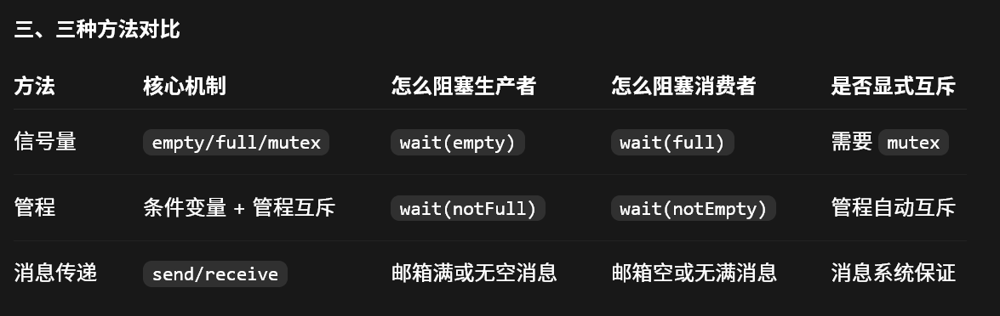
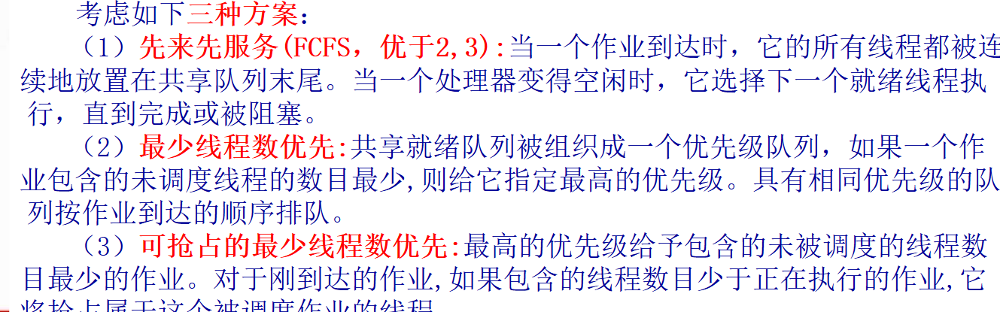
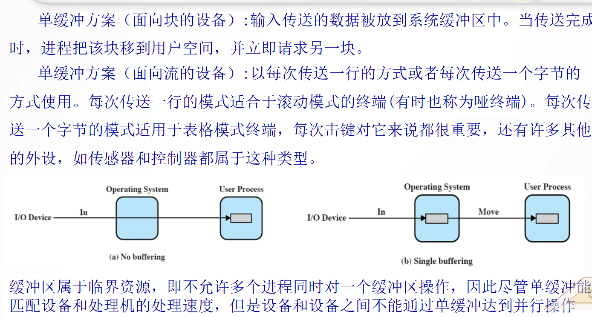
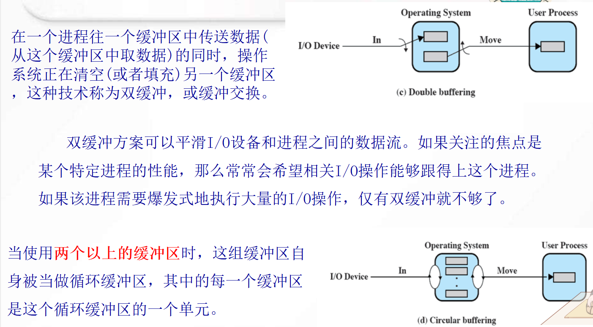
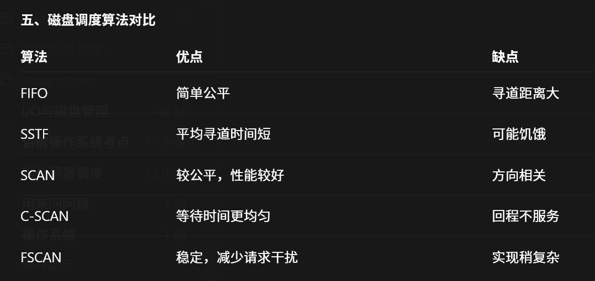
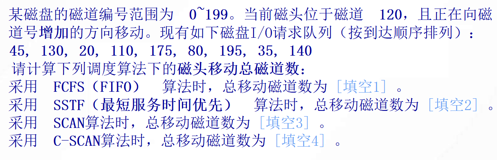
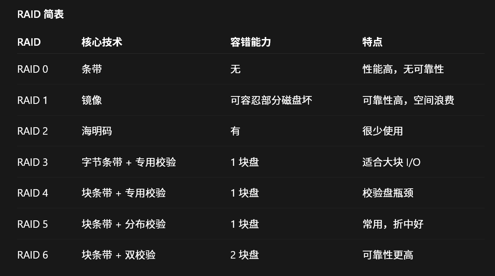
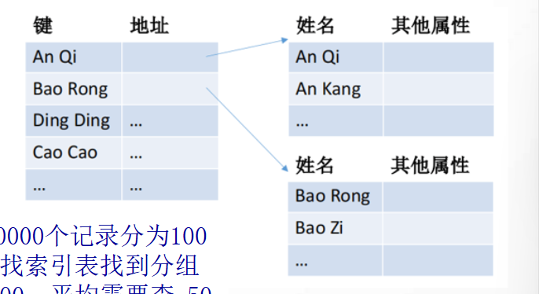
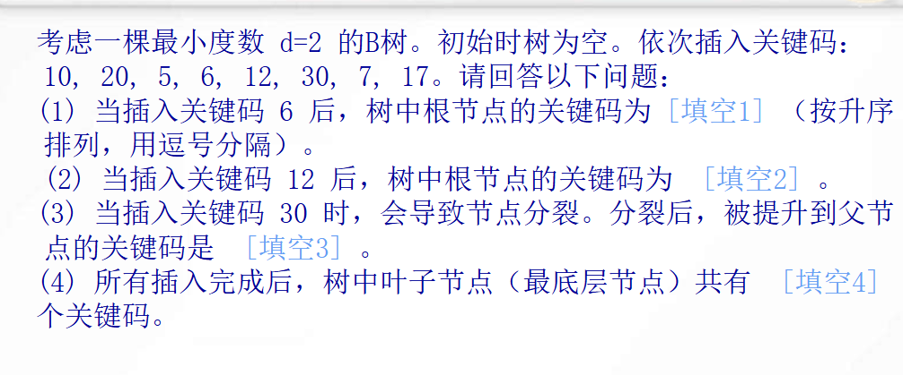
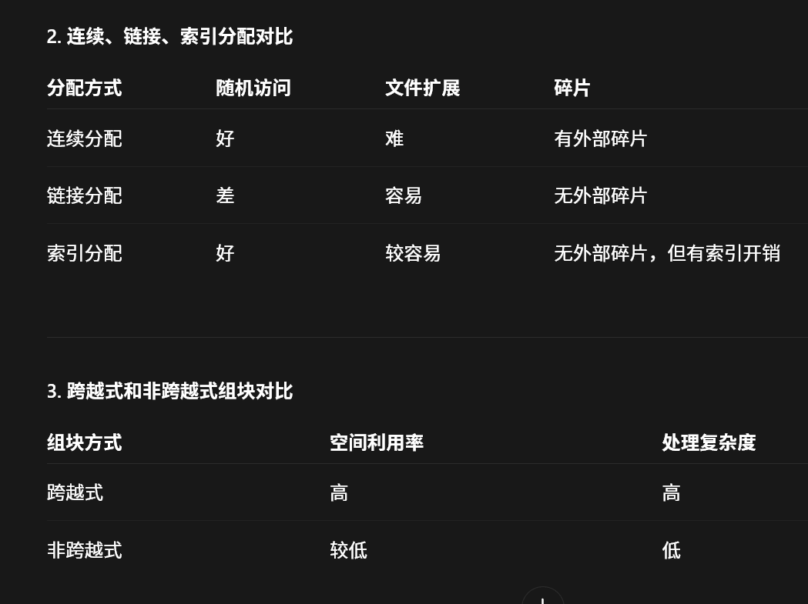

# 操作系统的三个目标
- 操作系统的目标包括**方便性**, **有效性**和**可扩展性**. 
	1. 方便性就是使得计算机更好使用; 
	2. 有效性指OS合理分配和管理系统资源; 
	3. 可扩展性就是OS结构应该便于在不妨碍服务的前提下, 有效的开发, 测试和引入新功能
# 进程
## 概念
- **进程是一个正在执行的程序实例**, 是系统正在进行资源分配和调度的基本单位
## PCB(进程控制块)
- PCB是操作系统为了管理进程而创建的数据结构, 是进程存在的唯一标志
- 其中包含三类信息, 进程标识信息, 处理器状态信息 和 进程控制信息
- 进程标识信息: 
	- 包括进程ID(PID), 父进程ID(PPID), 用户ID
- 处理器状态信息: 
	- 也叫CPU上下文信息, 用于进程切换时保留现场
	- 包括程序计数器, 通用寄存器等等
	- 作用: 
		- 一个进程被切断后, 下次继续运行时, 能从原来的位置接着继续
- 进程控制信息: 
	- 进程的五状态: 
		1. 新建态: NEW. 进程刚被创建
		2. 就绪态: Ready. 进程具备了运行的条件了, 差cpu
		3. 运行态: Running. 进程在CPU上运行
		4. 阻塞态/等待态: Blocked/Waiting. 进程因为某个事件不能运行, 比如等待I/O完成
		5. 退出态: Exit. 进程执行结束, 等待系统回收资源
	- 状态转换: 记住就绪 和 运行的区别就是有没有获得cpu
		- 运行->阻塞: 等待I/O或者某个事件
		- 运行->就绪: 时间片用完了, 或者被高优先级进程抢占了
		- 阻塞->就绪: 等待的事件完成了
		- 就绪->运行: 被调度程序选中, 获得cpu
		## 重要问题!!!
		- **阻塞态能不能直接转变为运行态?**
		- 不可以, 阻塞态等待事件完成后, 应该先进入就绪态, 等待调度器分配cpu, 分配到了才能进入运行态
	- 七状态: 多了挂起态
		- 多了就绪/挂起态 和 阻塞/挂起态
			1. 就绪/挂起态: 进程在外存中, 已经具备运行的条件了, 只需要加载进内存即可运行
			2. 阻塞/挂起态: 进程在外存中, 等待事件
		- 多的转换有哪些(主要的): 
			- 阻塞态->阻塞/挂起态: 内存紧张, 把阻塞进程换出到外存
			- 阻塞/挂起态->就绪/挂起态: 事件完成, 但进程仍在外存
			- 就绪/挂起态->就绪态: 被加载进了内存
			- 就绪态->就绪/挂起态: 内存不足时被换出
			## 为什么需要挂起状态?
			- 挂起态用于描述进程存在但是暂时不在内存中执行的情况. 引用挂起态可以支持交换技术, 同时缓解了内存压力, 提高了系统资源利用率

# 线程
## 为什么要引用线程? 
- 因为虽然进程也可以并发执行, 但是进程的创建, 销毁和切换的开销比较大, 所以引入了线程
## 概念
- 线程是进程中的一个执行路径, 是CPU调度和分配资源的基本单位
## 线程拥有的内容
- 每个线程都有属于自己的虚拟机栈, , 线程ID, 寄存器等等
- 同一个进程中的线程共享地址空间, 全局变量, 打开的文件, 进程资源
## 分类
- 分为用户级线程(ULT) 和 内核级线程(KLT)
- 用户级线程: 
	- 由用户空间的线程库去管理, 内核 `(内核是以进程为单位进行调度的)` 不知道这些线程
	- 优点: 
		- 创建和切换快
		- 不需要进入内核
		- 可移植性好
	- 缺点: 
		- 一个线程阻塞, 整个进程都会阻塞
		- 不能很好的利用多处理器
- 内核级线程: 
	- 由内核去管理
	- 优点: 
		- 一个线程阻塞, 不会阻塞整个进程
		- 很好的利用的多核cpu并行
	- 缺点: 
		- 创建和切换的开销大
		- 需要内核参与
- 混合方法: 
	- 就是线程创建全在用户空间完成, 一个进程的多个用户级线程会被映射到一些内核级线程上面. 
	- 优点: 
		- 这样的话, 同一个进程的多个线程可以在多个处理器上去并行运行, 同时某个线程引起阻塞也不会阻塞整个进程
## 状态
线程状态: 包括运行态, 就绪态 和 阻塞态 (无挂起态)
下面是线程状态改变的相关操作: 
1. 派生: 派生一个进程时也会为该进程派生一个线程
2. 阻塞: 线程等待某个事件. 比如等待I/O, 锁, 信号量
3. 解除阻塞: 等待的事件完成了, 线程被移动到就绪队列中
4. 结束: 线程执行完毕, 释放其寄存器上下文和栈
# 进程 vs 线程
- 进程是资源分配的基本单位, 线程是处理器调度或 CPU 调度的基本单位. 
- 多个线程共享一个进程的资源和地址空间, 但是每个线程也有属于自己的程序计数器, 栈 和 寄存器. 
- 线程创建和切换的开销比进程小, 更适合并发和并行
# 并发
## 概念
- 并发是宏观来看同一时刻也是多个任务并行执行, 但是在非常微小的时刻上来说, 只有一个任务进行. 通过时间片去轮转的, 因为切换速度够快, 所以宏观上表现为有多个任务共同执行
### 和并行的区别
- 并行就是**真正**同一时刻多个任务同时执行
## 互斥
### 临界资源
- 一次只允许一个进程或线程访问的资源
- 比如: 打印机, 共享变量, 缓冲区等等
### 临界区
- 程序中访问临界资源的那段代码.
### 互斥的概念
- 就是一个进程/线程进入临界区访问临界资源时, 其他进程/线程不能进入同一个临界区
### 临界区的四个原则
1. 互斥: 一次只能有一个进程/线程进入临界区
2. 有空让进: 就是临界区空闲并且有进程想进入, 那么应该允许一个进入, 不能无故拖延
3. 有限等待: 一个进程进入临界区后, 等待时间应该有限, 不能无限期等待
4. 忙等待: 等待时不应该一直占用CPU空转
### 生产者-消费者问题
#### 信号量
- 它有三个信号量: 
	- mutex = 1   // 互斥访问缓冲区的, 保证同一时间只有一个进程操控缓冲区. 0就是加锁, 1就是解锁
	- empty = n  // 空缓冲区的数量, 控制生产者的, 没有空位就阻塞
	- full = 0       // 满缓冲区的数量, 控制消费者的, 没有产品就阻塞
- 这里重要的是: 
	- 生产者必须先 wait(empty), 再 wait(mutex)
	- 消费者必须先 wait(fufll), 再 wait(mutex)
- 因为如果反过来的话, 生产者先wait(mutex)获取了锁, 然后wait(empty), 发现empty=0, 没有位置了, 被阻塞, 然后消费者又需要先wait(mutex)获取锁, 但是由于锁在生产者手上, 所以导致了死锁
```
经典版本: 
生产者: 
生产产品
wait(empty)   // 先确认有没有空位置, 如果有就-1, 线程继续往下执行, 否则阻塞
wait(mutex)   // 获取锁
放入产品
signal(mutex)
signal(full)

消费者: 
wait(full)  // 看缓冲区是否有产品
wait(mutex)
消费产品
signal(mutex)
signal(empty)
```
#### 管程(这里使用的是Mesa风格, 使用while+notify; 还有一个Hoare管程语义, 使用if+csignal)
- 把共享缓冲区和操作缓冲区的方法封装了起来, 保证**同一时刻只有一个进程**可以在管程内部执行, 天然解决互斥问题
- 其实它就是实现了两个方法, 然后生产者和消费者去调用方法
- 管程里一般有: 
	- buffer: 缓冲区
	- count: 计数变量
	- notFull: 生产者等待"缓冲区不满"; notEmpty: 消费者等待"缓冲区不空"
``` 伪代码
char buffer[N]
int count = 0
condition notFull
condition notEmpty

# 往缓冲区添加元素
void append(char x){
	while count==N do cwait(notFull)
	否则就是加入 x
	count++
	cnotify(notEmpty)
}

# 从缓冲区取出元素
procedure take(cahr x) returns x{
	while count==0 do cwait(notEmpty)
	否则就是取出 x
	count--
	cnotify(notFull)
	return x
}
```
#### 消息传递
- 有两个邮箱, mayproduce, mayconsume
- **初始化**, mayproduce中放N个空消息, mayconsume为空
```
void producer(){
	recevie(mayproduce, msg)
	读取到消息就生产数据msg, 否则阻塞
	send(mayconsume, msg)
}
void consumer(){
	receview(mayconsume, msg)
	读取到消息就消费数据, 否则阻塞
	send(mayproduce, null)
}
```

### 读者-写者问题
- 就是多个进程共享一个数据对象
- 规则: 
	- 多个读者可以同时读
	- 写者写的时候, 禁止其他读者读写
- 变体: 
	1. 读者优先: 
		- 只要有读者在读, 后来的读者也可以加入.
		- 问题: 写者可能长期等待, 产生写者饥饿
	2. 写者优先: 
		- 如果有写者等待，后来的读者不能插队
		- 问题: 读者可能等待更久
	3. 公平策略: 
		- 按请求顺序服务，避免饥饿
### 信号量
- 一个信号量可以初始化为非负数(>=0)
- `wait()`, 也叫 `P()` 操作
- `signal()`, 也叫 `V()` 操作
- wait(S), 信号量-1, S=S-1, 如果S<0, 那么阻塞进程
- signal(S), 信号量+1, S=S+1, 如果S<=0, 那么就唤醒一个阻塞的进程
#### 计数信号量和二元信号量
- 计数信号量: 非二元信号量
- 二元信号量: 初始化为0/1
	- wait(S), 检查S是否为0, 如果是0就阻塞, 如果为1则-1改为0, 进程继续执行
	- signal(S), 检查是否有进程受阻, 如果有, 那么唤醒; 如果没有, 设置S值为1
### 软硬件
- CAS
### 管程
- 把共享数据和访问共享数据的操作封装到一起, 保证同一时刻只有一个进程在管程中执行
- 优点: 
	- 信号量需要保证所有访问资源的进程都被正确编写时, 资源访问才是正确的; 而管程只需要自己被正确编写, 那么所有进程对于共享资源的访问都是正确的
### 消息传递
- send(destination, message)
- receive(source, message)
- 发送和接收方都可以是阻塞和非阻塞的, 常用的为send非阻塞, recevie阻塞: send发送完可以继续发送, 而recevie则阻塞等待消息的到来
- 寻址: 
	- 直接寻址: 
	- 间接寻址: 发送消息不是直接发送到接受者, 而是发送到一个共享的数据结构上, 叫信箱
## 死锁
### 概念
- 一组进程里的每个进程都在等待某个事件, 但是这个事件只能被这组进程中其他被阻塞的进程触发, 这就发生了死锁
### 四个条件
1. 互斥: 资源一次只能被一个进程占用
2. 占有且等待: 进程持有资源同时等待其他资源
3. 不可抢占: 资源不能被强制释放
4. 循环等待: A进程等待B进程, B进程等待A进程
### 处理办法: 死锁预防/避免/检测
- 死锁预防: 破坏四个条件中的一个
	- 2. 一次性申请所有需要的资源
	- 3. 先释放自己占用的资源再去获取其他
	- 4. 给资源编号, 进程按编号顺序申请
- 死锁避免: 分配资源前先判断是否安全, 只在不会造成死锁的情况下分配
	- 1. 如果一个进程的请求会导致死锁, 不启动该进程
	- 2. 如果一个进程增加的资源请求会导致死锁, 不允许此分配
- 死锁检测: 检查是否死锁, 然后恢复
### 哲学家就餐问题
- 场景：
	- 五个哲学家围坐一桌。
	- 每人左右各有一根筷子。
	- 哲学家要吃饭必须同时拿到左右两根筷子。
	- 每根筷子一次只能被一个哲学家使用。
#### 信号量
- 最多只允许4名哲学家同时进入餐厅, 保证至少有一名哲学家可以拿到两把叉子
- 通过破坏了循环等待这个条件来防止死锁; 但是它无法避免饥饿, 因为某个哲学家可能一直进不去room
```
伪代码
room = {4} //限制4个人进餐厅
fork[5] = {1} // 5个叉子, 初始化为1
void persor(int i){
	think() // 哲学家思考
	wait(room) // 进入房间, 阻塞第五个哲学家
	wait(fork[i]) // 获取左边的叉子
	wait(fork[(i+1) mod 5]) // 获取右边的叉子
	eat(); // 吃
	signal(fork[(i+1) mod 5])
	signal(fork[i])
	signal(room) // 出房间
}
```
#### 管程
- 定义了两个方法, `get_forks` 和 `release_forks`
- 同时有 `cond ForkReady[5]`是否有哲学家在等待; `fork[5]={true}` 默认true时叉子可用
- 因为管程的互斥性保证了一次只有一个哲学家可以执行get_fork或者release_fork操作
```
cond ForkReady[5]
bool fork[5] = {true, true, true, true, true};
void get_forks(int pid){
	int left = pid
	int right = (pid + 1) % 5

	while (!fork[left] || !fork[right]) {
        cwait(ForkReady[pid]);
    }

	fork[left] = false;
    fork[right] = false;
}

void release_forks(int pid) {
    int left = pid;
    int right = (pid + 1) % 5;

    fork[left] = true;
    fork[right] = true;

    csignal(ForkReady[(pid + 4) % 5]);
    csignal(ForkReady[(pid + 1) % 5]);
}
```
# 内存管理
## 虚拟内存
- 定义: 是一种内存管理技术, 把进程使用的地址空间和实际的物理内存分离开, 使得程序可以使用比物理内存更大的逻辑地址空间
- 意思就是程序看到的是虚拟内存(逻辑地址), 实际访问的是物理内存(物理地址)
### 需要硬件支持
- 比如MMU(内存管理单元): 负责地址转换; 
- TLB(快表): 加速地址转换, 就是把常用的放到这里面, 类似缓存; 
- 缺页中断机制: 访问的页不在内存中时触发, 由操作系统去外存中找到替换到内存中, 这里替换有**页面置换算法**
### 逻辑地址->物理地址
- CPU产生虚拟地址->MMU去查询页表/段表->找到物理地址->访问主存
- 如果地址对应的页不在内存->产生缺页中断->操作系统置换页面从外存到内存->更新页表->重新执行指令
- 所以: 地址转换由MMU完成, 操作系统负责建立和维护页表/段表, 处理缺页中断
### 页式内存管理
- 概念: 
	- 页: 虚拟地址空间中的固定大小块
	- 页框: 物理内存中的固定大小块
	- 页表: 存储虚拟地址->物理地址的映射关系
	- 页表项(PTE): 页表的一项, 对应下一个虚拟页
- 转移检测缓冲区(TLB/快表): 缓存最近用过的页表项, 加快地址映射
	- 作用: 
		- 没有TLB, 那么就需要访问两次内存
			1. 根据逻辑地址的页号找到页表, 找到对应的页框
			2. 然后组装物理地址去访问真正的数据
		- 有了TLB, 访问1次
			1. 直接查TLB是否有(不计入内存访问次数)
			2. 命中直接返回页框
- 地址转换: 记住 `逻辑地址 = 页号 + 页内偏移`
	- 如果地址是十进制
		- 先看页面大小, 比如1KB=1024B
		- 然后用虚拟地址除以页面大小: 
			- 页号=虚拟地址 整除 页面大小
			- 偏移量=虚拟地址 除以页面大小的余数
		- 接下来用页号找到页框
		- 然后用物理地址=页框 * 页面大小+偏移量
	- 如果地址是二进制
		- 先看页面大小=2^n, 比如4KB=2^12
		- 这里的低n位=页内偏移, 高位为页号
		- 后面的正常, 找到页框后可以把它转变为二进制替换掉页号就是物理地址
	- 如果地址是16进制: 
		- 依旧先看页面大小, 比如4KB=2^12
		- 那么就知道了低12位为页内偏移, 剩余高位为页号
		- 接下来由于 1个16进制位 = 4个二进制位, 所以低12位二进制位=低3位16进制位, 剩余为页号
		- 那么比如逻辑地址=0x3A7F, 拆分后就是 `(页号, 页内偏移) = (0x3, 0xA7F)`
### 段式内存管理
- 段式虚拟地址结构: 段号 + 段内偏移
- 段表项包括: 
	1. 段基址: 该段在物理内存中的起始地址
	2. 段长: 该段的长度, 用于越界检查
	3. 保护块: 控制读, 写, 执行权限
- 地址转换: CPU访问虚拟地址(1, 200). 1是段号, 200是偏移量
	- 先用段号查段表, 找到段基址和段长
	- 然后检查段内偏移是否合法, 比如段长500, 段内偏移400, 合法; 段内偏移600, 不合法
	- 最后计算物理地址, 通过物理地址=段基址+段内偏移
### 段页式内存管理
- 先按逻辑分段, 再把每个段分页
- 虚拟地址结构: 虚拟地址=段号+页号+页内偏移
- 地址转换: 
	- 先用段号查段表找到对应的页表
	- 然后用页号查页表找到页框
	- 页框号+页内偏移得到物理地址
## 操作系统软件
### 页面置换策略
1. 最佳OPT: 理论最优. 淘汰掉以后最长时间不会被访问的页面
2. FIFO: 先进先出. 最早进入内存的页面被淘汰
3. LRU: 最近最少使用.
4. Clock时钟算法: 
	- 第一种: 一个圆盘, 有一个指针指向这n个的页框, 一个页框内是一页, 每一页都有一个使用位为0/1. 当进行页面替换时, 看使用位, 如果为0, 就替换这一页, 如果为1, 就把该页的使用位置0, 指针后移, 继续检查
	- 第二种: 如果页框多了一位修改位, 就像(u=0, m=0)最近未被访问, 也未被修改, 这样的. 那么时钟算法变为:
		- 1. 从指针位置出发, 扫描页框缓冲区, 这次扫描不对使用位做修改, 置换遇到的第一个页框(u=0, m=0)
		- 2. 第一步失败, 开始第二次扫描, 替换(u=0, m=1)的页框. 这次扫描将跳过的页框(u=1)的使用位u置0
		- 第2步失败, 指针回到初始位置, 并且把所有页框的使用位置0, 重复第一步, 有需要再重复第二步
### 驻留集管理
- 任何时刻进程实际在内存中的部分称为进程的驻留集. 也就是一个进程在内存中有多少个页框
- 太小: 
	- 缺页频繁
	- 系统抖动(抖动就是系统把时间花在页面的调入和调出上, 而不是执行进程本身)
- 太大: 
	- 单个进程占用过多内存
	- 多道程序运行速度下降
- 就有了驻留集管理三种办法: 
	1. **固定分配，局部范围**
	2. **可变分配，全局范围**
	3. **可变分配，局部范围**
	- 先说固定/可变分配: 
		- 固定: 给进程固定数量的页框, 运行期间不变
		- 可变: 分配给进程的页框数可以根据缺页率动态变化
	- 然后看局部/全局置换范围
		- 局部: 缺页时, 只能从本进程自己的页框中选择页面换出
		- 全局: 缺页时, 可以从所有进程的页框中选择页面换出
	1.  **固定分配，局部范围**
		- 每个进程获得固定数量的页框；发生缺页时，只能替换本进程自己的页面。
		- 缺点: 
			- 分配过少, 缺页率高
			- 分配过多, 内存中只能有几个程序, 处理器有很多空闲时间, 并且大量时间花费在交换上
	2.  **可变分配，全局范围**(被许多操作系统采用)
		- 进程拥有的页框数可以动态调整, 缺页时可以把一个空闲的页框添加到进程的驻留集中; 没有空闲页框后从全局内存中挑选页面去换出
		- 缺点: 一个进程可能会抢占其他进程的页框
		- 可以使用页缓冲解决置换页面的性能问题
	3. **可变分配，局部范围**
		- 进程页框数可以调整，但具体页面置换仍限制在本进程范围内。
		- 比第二种性能更好
# 处理器调度
- 意思就是决定操作系统决定哪个进程或者线程获得cpu执行
- 它分为三种: 
	- 长程调度: 也叫作业调度, 负责哪些作业进入系统, 成为进程. (即从外存的作业中选择作业装入内存, 创建进程)
	- 中程调度: 也叫换入/换出调度, 负责进程从内存->外存, 外存->内存. 和前面说的进程的挂起状态: eg: 就绪态->阻塞挂起态, 阻塞态->就绪挂起态
	- 短程调度: 也叫CPU调度, 负责从就绪队列中选一个进程/线程, 把CPU分配给它
## 短程调度
- 短程调度的算法为: 单处理机调度, 多处理机调度和实时调度
### 单处理机调度
- FCFS(非抢占): 先来先服务, 可能会导致护航效应
	- 规则: 按照线程达到就绪队列的先后顺序执行
	- 护航效应: 一个长进程占着CPU, 后面一堆短进程都要等待, 导致平均等待时间变长
- 时间片轮转(RR)(抢占式): 常用于分时系统. 
	- 规则: 每个进程获得一个固定的时间片, 用完后还没执行完, 就回到就绪队列让出CPU, 然后基于FCFS选择下一个进程
	- 问题: 
		- 时间片太大: 会退化为FCFS
		- 时间片太小: 上下文切换频繁, 系统开销大
- 最短进程优先(SPN/SJF)(非抢占): 
	- 规则: 每次选择预计服务时间最短的进程运行
- 最短剩余时间优先(SRT)(抢占式): 上一个的抢占式版本
	- 规则: 每次选择剩余运行时间最短的进程. 如果新到达的进程运行时间比当前进程的剩余运行时间更短, 就抢占
- 最高响应比优先(HRRN)(非抢占): 
	- 规则: 选择响应比最高的进程运行
	- 响应比: 
		- **响应比(归一化周转时间)**=(等待时间+服务时间) / 服务时间 = 周转时间 / 服务时间
		- 周转时间(进程从提交到完成的时间) = 完成时间 - 到达时间
		- 等待时间(在就绪队列中等待CPU的时间) = 周转时间 - 服务时间
		- **归一化周转时间** = 周转时间 / 服务时间
### 多处理器调度-线程调度
- 负载均衡: 系统维护一个就绪线程的全局队列, 每个处理器只要空闲就从队列中选择一个线程

- 组调度: 把一组相关线程同时调度到多个处理器上运行. 适合并行程序
- 专用处理器分配: 给某个应用或线程集合分配一组固定处理器
	- 优点: 
		- 减少调度开销
		- 减少进程迁移
		- 适合并行任务
	- 缺点: 
		- 如果暂时不用CPU, 专用处理器会空闲
- 动态分配: 操作系统根据系统负载和应用需求, 动态调整给进程或线程的处理器数量
### 实时调度
- 就是在规定时间内完成任务
- 实时任务分类: 
	- 硬实时系统: 必须在截至前完成任务, 否则系统失败(比如汽车安全气囊, 飞行控制等等)
	- 软实时任务: 希望在截至时间前完成任务, 偶尔错过会降低服务质量, 但不一定导致灾难(比如视频播放, 网络音频等等)
	- 周期性实时任务: 外部设备周期性发出激励信号给计算机, 要求它按照指定周期循环执行, 以便周期性地控制某外部设备
	- 非周期性实时任务: 无明显周期, 但是有开始/完成时间
- 实时操作系统要具备五个方面的要求: 可确定性, 可响应性, 用户控制, 可靠性 和 故障弱化操作
	- 可确定性: 指系统可以按照固定的, 预先确定的时间或者时间间隔来执行操作
	- 可响应性: 
		- 可确定性关注: 操作系统获知中断之前的延迟
		- 可响应性关注: 操作系统知道中断后, 为中断提供服务所需的时间
	- 用户控制: 
		- 就是在非实时系统中, 用户要么对于操作系统的调度功能没用任何控制, 要么仅给一些概括性的指导, 像把用户分成多个优先级组
		- 但是在实时系统中, 必须允许用户更细粒度地控制任务优先级, 用户要能够: 
			- 区分硬实时和软实时任务
			- 每类任务内部的相对优先级
			- 是否使用分页还是还是进程交换
			- 哪些进程必须常驻
			- 使用哪种磁盘传输算法
			- 不同优先级进程有哪几种权限
	- 可靠性: 
		- 实时系统中更重要
		- 非实时系统可以通过重启解决故障; 多处理器的非实时系统, 一个处理器失败可能只导致服务级别降低
		- 但是实时系统实时响应和控制事件, 性能的损失和降低可能会导致灾难性后果
	- 故障弱化操作: 系统发生故障时尽可能的保留其性能和数据
- 实时调度算法: 
	- 
	- 静态表调度法(适合周期性任务): 执行关于可行调度的静态分析. 分析结果是一个调度, 用于确定运行时一个任务何时开始
	- 静态优先级抢占法: 执行静态分析, 但是没用制定调度. 通过给任务指定优先级, 运行时优先级高的任务可以抢占优先级低的任务
	- 基于动态规划调度法: 运行时根据当前的任务集合动态的生成调度计划
	- 动态尽力调度法: 不执行可行性分析. 系统尽最大努力满足实时系统的最后期限, 但不严格保证
- 有资源空闲时间的最早最后调度: 
	- 意思就是即使当前有任务可以执行, 系统可能也会故意空闲一段时间, 以便紧急任务到来时得到更好的整体调度
	- 普通的最早最后调度就是: 谁的完成最后期限越早, 谁先执行
- 速率单调调度(RMS): 周期越短, 优先级越高
	- 优先级反转: 就是系统内的环境迫使某个较高优先级的任务去的等待一个较低优先级的任务, 而中优先级的任务又抢占低优先级的任务, 导致高优先级的任务长时间无法运行
		- 例子: 比如锁, 一个低优先级的任务持有锁, 然后来了一个高优先级的任务, 也需要这个锁, 就被阻塞了. 然而中优先级的任务不需要锁, 就先执行了, 导致高优先级的任务一直等待
		- **解决办法**: 
			- 优先级继承: 就是如果低优先级的任务持有高优先级任务需要的资源, 那么低优先级的任务将临时继承高优先级任务的优先级, 直到资源释放
			- 优先级置顶: 给资源和优先级关联, **资源的优先级**被设定为所有会访问该资源中任务的最高优先级还要高一级, 当该资源被分配给任务时, 任务临时提升到与资源相同的优先级等级.
			- 作用: 都是为了防止低优先级任务持有高优先级任务需要的资源时，被中优先级任务抢占太久. `(就像例子说的那样)`
# I/O 与 磁盘调度
## I/O管理的三个阶段
- 分别为程序控制I/O, 中断驱动I/O, 和 直接存储器访问(DMA)
- 区别在于CPU在I/O过程参与多少
- 程序控制I/O: CPU发出I/O命令, 进程忙等待(意思就是进程一直占着CPU检查I/O是否完成), 直到操作完成后继续执行
- 中断驱动I/O: CPU发出I/O命令后继续执行其他的工作, I/O完成后通过中断通知CPU
- 直接存储器访问(DMA): CPU只负责启动传输, 数据块由DMA在内存和I/O模块之间直接传送, 完成后中断CPU
## 设计目标
1. 效率: 通过缓冲. 有单缓冲, 双缓冲 和 循环缓冲
   
   
2. 通用性: 
   
## 磁盘调度
- 目的是减少磁头移动, 提高磁盘I/O性能
- 磁盘访问时间 = 寻道时间 + 旋转延迟 + 传输时间
### 性能参数
1. 寻道时间: 磁头移动到目标磁道需要的时间
	   比如磁头现在在50号磁道, 要访问150号磁道, 就要移动100个磁道距离
	   **磁盘调度算法**主要为了减少寻道距离
2. 旋转延迟: 磁头到达目标磁道后, 等待目标扇区旋转到磁头下方的时间
   `平均旋转延迟 = 磁盘旋转一圈的时间 / 2`
3. 传输时间: 数据真正从磁盘传到内存 或者 从内存写到磁盘的时间
4. `平均存取时间= 平均寻道时间 + 平均旋转延迟 + 平均传输时间`

答案为: 64   20040
### 磁盘调度算法
- 多个磁盘I/O请求到达时, 按照什么顺序服务, 才能减少磁头移动的距离
1. FIFO: 按请求到达的顺序处理磁盘I/O请求(磁头的移动方向不影响, 谁先来就处理谁)
2. SSTF(最短服务时间优先): 每次选择离当前磁头位置最近的请求
	   缺点: 可能会导致饥饿
	   原因: 如果磁头附近不断有新请求到来, 那么远处的请求可能一直等不到服务   
3. SCAN(电梯算法): 磁头沿一个方向移动, 途中服务所有的请求; 到达一端后反向移动
4. C-SCAN(循环扫描): 磁头只在一个方向上服务请求, 到达末端后直接返回起点, 中途不服务请求
5. FSCAN(SCAN的改进): 使用两个队列, 扫描期间只处理一个队列中的请求; 扫描过程中的新请求放到另一个队列, 等待下一轮再处理


答案分别为: 900, 315, 258, 388
### RAID(独立磁盘冗余阵列)
- 把多个物理磁盘组合成一个逻辑磁盘
- RAID利用数据条带, 镜像 和 数据校验技术来获取高性能, 可靠性, 容错能力 和 扩展性
	1. 数据条带: 把连续数据以块的方式分散存储到多个磁盘中
		   **优点**: 多个磁盘可以并行执行, 性能高
		   **缺点**: 没有改善可用性和可靠性. 如果没有冗余, 一个磁盘坏了, 数据就会丢失
	   RAID 0 就主要使用条带化
	2. 镜像: 一种冗余技术, 防止磁盘发生故障造成的数据丢失. 具体来说就是同一份数据同时写到两个或多个磁盘上
		   **优点**: 可靠性高; 镜像提供了完全的数据冗余能力; 读操作可以并行
		   **缺点**: 成本高, 存储利用率低
	   RAID 1 使用镜像
	3. 数据校验: 是一种冗余技术, 它用校验数据来保证安全, 可以检测数据的错误, 并在能力允许的前提下进行数据重构
		   优点: 比镜像节省空间; 能容忍磁盘故障
		   缺点: 写入时需要计算和更新校验信息; 写性能有开销
		RAID3, 4, 5, 6都和校验有关
- RAID 0 : 条带化, 无冗余(所以它并不是RAID家族的真正成员)
	- 特点: 可以并行执行, 性能高
	- 缺点: 任意一个数据条带的损坏都会导致整个数据不可用
- RAID 1 : 镜像
	- 特点: 可靠性好; 读性能好
	- 缺点: 成本高, 存储利用率约50%
- RAID 2 : 位级条带 + 海明码校验
	- 缺点: 成本高; 输出性能受阵列中最慢磁盘驱动器的限制.
	- **目前主流的存储磁盘阵列均不支持RAID2支持**.
- RAID 3 : 字节级条带 + 专用校验盘
	- 特点: 数据按字节分散; 同一带区的数据使用异或校验生成校验值; 可以通过校验数据(检验值)和完好数据来重建数据
	- 缺点: 检验盘容易成为瓶颈
- RAID 4 : 块级条带 + 专用校验盘
	- 特点: 数据按块分散; 一个专用校验盘; 支持并发读
	- 缺点: 写操作只能一个一个磁盘的写, 还要更新校验数据; 单一的校验盘易成为系统性能瓶颈
	- **RAID4 在实际应用中少见, 主流的存储产品也很少使用**
- RAID 5 : 块级条带 + 分布式校验
	- 特点: 校验信息分布在所有的磁盘上, 没有专门校验盘; 写操作也支持并发了
	- 优点: 存储性能, 数据安全 和 存储成本都折中好
	- 缺点: 只能容忍一个磁盘故障
	- **是常见的RAID级别, 常被使用**
- RAID 6 : 块级条带 + 双重分布式校验
	- 特点: 有两组校验信息; 校验数据既可以存储在两个检验盘上, 也可以分布在磁盘上; 支持阵列中两个磁盘故障的恢复
	- 缺点: 成本高与RAID5; 写性能差; 实现复杂
	
### 磁盘高速缓存
- 就是在**内存**开辟一块区域, 用来保存最近访问过的磁盘块
- 利用了局部性原理: 
	- 时间局部性: 最近访问过的数据, 可能还会被访问
	- 空间局部性: 访问过某个磁盘块后, 附近的磁盘块也可能被访问
- 置换策略: 
	- **LFU(最不常使用页面置换算法)**, 这个你知道的, 字面意思. 给每个块关联了一个计数器.
		- 它有个问题: 可能有一些块, 整体上来看访问不频繁; 但是因为局部性原理, 会在一段很短的时间内被频繁访问, 导致计数器的值很高
	- 因此为了解决这个问题, 出来一个新算法, 叫: **基于频率的置换算法**
		- 意思就是: 块会在逻辑上被视为一个栈, 栈顶保留一部分作为**新区**. 当出现一次高速缓存命中时, 把命中的块放进新区. 
		  同时, 如果它已经在新区了, 那么计数器不变, 否则就+1
		  当发生未命中时, 就从不在新区的块中选一个去置换, 如果块很多, 那么就使用lfu
		- 优点: 这样就保证了短时间内被重复访问的块的计数器不会变化, 解决了lru的问题
		- 它也有一个**问题**: 刚进入缓存的新块, 它的计数器的值必然是最小的, 它访问完后可能会因为来不及去建立新的访问计数就被置换算法给置换出去了
			- 这是因为只有新区的话访问完这个块就不在新区了, 它再次被访问这个中间有时间差, 可能会被置换
		- 解决办法: 把栈划分为, 新区, 中间区 和 老区. 新区和上面一样, 但是现在只有在老区中的块才能被置换. 中间区就是用于给频繁被访问的块增加访问计数的机会, 防止被快速置换
# 文件管理
#### 文件的属性
1. 长期存在: 文件会被存储在硬盘和其他的辅存上, 用户退出系统时文件不会丢失
2. 进程间可共享: 文件有自己的名字, 具有相关的允许受控的共享访问权限 
3. 结构: 每个文件都有具体与特定应用的内部结构, 除此之外也可以被组织成层次结构或更复杂的结构去反映文件之间的关系
#### 文件结构
1. 域: 基本数据单元. 它的长度可固定可变, 对于后者说明域中有几个子域: 要保存的实际值, 域名还包括在某些情况下域的长度
   
2. 记录: 一组相关域的集合
   
3. 文件: 一组相关记录的集合
   
```
	 文件也分为有结构文件和无结构文件: 
	   有结构的文件由若干个相关记录组成
	   无结构的文件被看成是一个字符流
```
#### 文件组织
- 包括 `堆, 顺序文件, 索引顺序文件, 索引文件, 直接或散列文件`
- 堆: 数据按达到的顺序收集. 穷举法查找
- **顺序文件**: 记录按某种顺序连续排列, 通常用关键词去顺序排列
	- 顺序的组织形式: 
		- 串结构: 记录的顺序与关键字无关, 通常按记录的**插入时间**
		- 顺序结构: 记录的顺序按关键字排序(关键域: 唯一地标识这条记录. 比如数字关键域按数字顺序; 文本关键域按字母顺序等等)
- **索引顺序文件**: 除了关键域以外, 每条记录还新增了用于随机访问的文件索引 和 溢出文件. 索引文件的每条记录由两个域组成: 关键域和指向主文件的指针, 其中的关键域和主文件的关键域相同
	
- 索引文件: 摒弃了顺序性 和 关键字, 通过给文件建立索引表来快速访问
- 直接/散列文件: 利用哈希函数, 基于关键字的散列
	
#### B树
- 性质: 最小度数为d的树要满足: 
  1. 每个节点最多有2d-1个关键码 和 2d个子女
  2. 除了根节点, 每个节点至少有d-1个关键码 和 d个子女
  3. 根节点最少有1个关键码 和 2个子女
  4. 所有的叶子都在同一层, 不包含任何信息
  5. 一个包含k个指针的非叶子节点有k-1个关键码
- 如何插入: 
  1. 搜索关键码, 如果不在树种, 到达最底层的一个节点
  2. 如果当前节点的关键码小于2d-1, 那么按合适的规则插入进去
  3. 如果当前节点是满的, 那么已该节点中间的关键码分裂开, 每个新节点包含d-1个关键码, 并且把中间的关键码(如果是偶数选左边那个)(提升关键码要先把它放到当前节点中, 按照规则进行排序后再决定提升哪一个)提到上一层. 
    如果新的关键码新的关键码小于中间的关键码, 把它插入左边的新节点; 否则插入右边
  4. 提升的节点按3的规则插入父节点
  5. 如果提升的过程中达到了根节点并且根节点是满的, 那么按照3进行插入, 这种情况下, 中间的关键码变成了一个新的根节点并且树高加1
    
    答案为6, 6, 12, 6
#### 记录组块
- 有三种组块方法: 固定组块, 可变长度的跨越式组块 和 可变长度的非跨越式组块
- 固定组块: 每个块放固定数量, 固定长度的记录. 可能会有内部碎片
- 可变长度的跨越式组块: 一条记录可以跨越两个或多个物理块
  优点: 空间利用率高, 无内部碎片问题
  缺点: 记录处理复杂, 需要额外指针或长度信息
- 可变长度的非跨越式组块: 一条记录不能跨越块边界, 如果当前块剩余空间不够就放到下一个块
#### 辅存管理
- 就是解决文件的数据块如果分配在磁盘上
- 连续分配: 文件占用一组连续的磁盘块.  文件分配表只需要一个表项, 说明起始块号 和 文件长度即可
- 链接分配: 链接分配基于单个的块, 文件由一组磁盘块组成, 每个块中保存指向下一个块的指针. 
  问题: 局部性原理不在适用
- 索引分配: 为每个文件建立了一个索引块, 索引块保存该文件所有数据块的地址
  
##### 空闲空间管理
- 解决OS如何记录磁盘上哪些块是空闲的
  1. 位表: 用一串二进制数表示磁盘是否空闲, 等同于Bitmap
     优点: 查找连续空闲块方便, 结构简单
     缺点: 占用空间大
  2. 链接空闲区: 把空闲块或空闲区通过指针连接成链表
     优点:  分配单个空闲块方便
     缺点: 查找连续空闲块困难
  3. 索引: 使用索引表记录空闲块地址
  4. 空闲块列表: 系统维护一张空闲块编号列表, 记录所有可用的磁盘块.  (位于磁盘中)
     优点: 分配时从列表取块即可
     缺点: 列表会很大, 查找连续空间不一定高效
