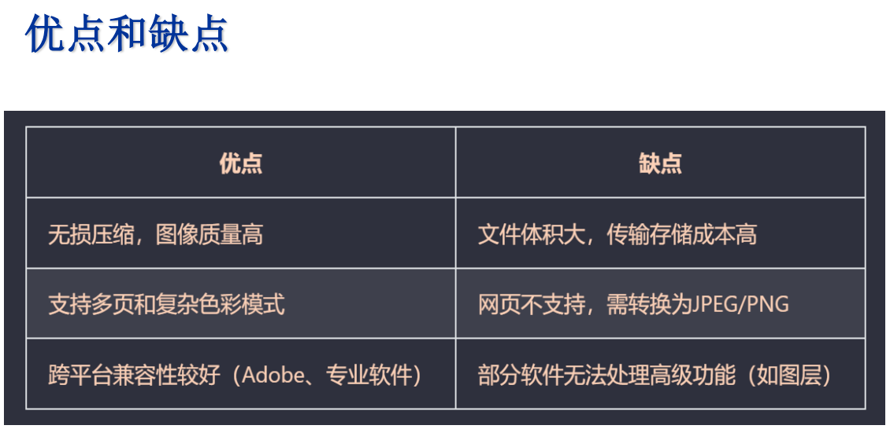

# 图像的文件格式有: BMP, JPEG, GIF, TIFF, PNG等
---
   1. TIFF: 是一种灵活且高质量的光栅图像格式, 广泛用于专业图像处理, 印刷, 摄影 和 文档存档等领域
	   1. 支持高质量无损压缩, 也可以选择有损压缩(如JPEG)
	   2. 多颜色模式和位深度(即RGB, MYK多种颜色模式; 位深度灵活: 8, 16, 32 甚至更高位)
	   3. 多页存储能力(就是单个TIFF文件可包含多页图像)
	   4. 
2. JPEG: 是一种有损压缩格式, 能够将图像压缩在很小的储存空间, 图像中重复或不重要的资料会被丢失, 因此容易造成图像数据的损伤
3. PNG: 无损压缩方式, 减少文件的大小保证最不失真的格式