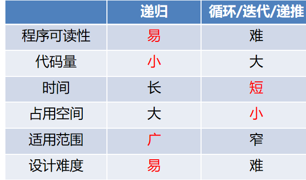

# 1
1. 算法的基本特征: 有穷性、确定性、可行性、输入、输出
# 2
1. 评价算法的标准: 
	1. 算法维护的 **方便性**
	2. 算法的时间成本(时间复杂度/耗费时间)
	3. 算法的空间成本(空间复杂度/占用存储)
2. 复杂度排序 `O(1)<O(logn)<O(n)<O(nlogn)<O(n2)<O(n3)<O(2n)<O(n!)<O(nn)`
3. 算法的存储量: 输入数据/ 算法本身/ 辅助变量所占空间
4. 提高算法的质量: 
	1. 保证正确性, 可靠性, 健壮性, 可读性
	2. 提高效率
# 3

# 4
## 动态规划
### 数塔问题
```

从数塔顶部走到底部，每次只能走到下一层相邻位置，求路径数字和最大。
        9
      12  15
    10   6   8
   2   18   9   5
19   7   10   4   16
从底向上 设: d[i][j] = 从第 i 层第 j 个数出发，到塔底能得到的最大路径和
data[i][j]当前站的位置

那么 d[i][j] = data[i][j] + max(d[i+1][j], d[i+1][j+1])

第5层 d：
19   7   10   4   16

第4层：
2+max(19,7)=21
18+max(7,10)=28
9+max(10,4)=19
5+max(4,16)=21

第3层：
10+max(21,28)=38
6+max(28,19)=34
8+max(19,21)=29

第2层：
12+max(38,34)=50
15+max(34,29)=49

第1层：
9+max(50,49)=59

得到最大路径和为59
对应路径: 9 -> 12 -> 10 -> 18 -> 10
```
### 资源分配
```
有总资源 a，分给 n 个项目。第 i 个项目分到 x 资源时收益为 g_i(x)，要求总收益最大。

```

