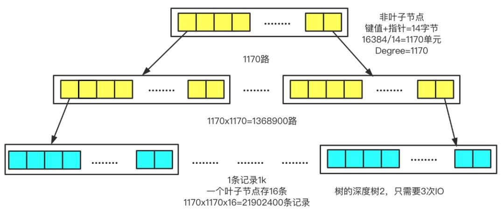
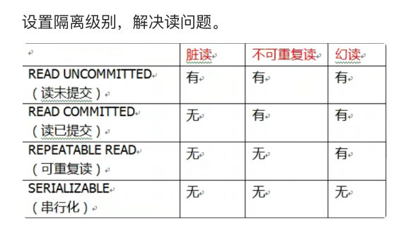

- 存储emoji: emoji占据4个字节的UTF-8字符, 而MySQL的utf8只有3个字节的UTF-8字符, 所以需要使用utf8mb4字符集
- varchar和char的区别: varchar是可变的, char是不可变的
- MySQL的分层: 分为三层
	- 连接层: 管理客服端的连接和权限验证
	- 服务层: 解析SQL语句/ 优化SQL
	- 存储引擎层: 负责数据的提取与存储
	binlog位于服务层
- 一条SQL语句的执行过程: 
	- 客服端发起连接请求, 发送SQL向MySQL服务器
	- 连接器处理请求, 进行权限验证
	- 解析器解析SQL, 是否有语法错误
	- 优化器优化SQL, 制定执行计划, 来决定它使用哪个索引, 表的连接顺序等等
	- 执行器执行计划, 调用存储引擎的接口来执行
	- 存储引擎查询到了数据, 返回给客服端, 客服端收到结果, 结束
- 常见的存储引擎: InnoDB, MyISAM, MEMORY, 除此之外还有:
	- MySQL在5.5之前用的还是MyISAM, 之后是InnoDB
	- InnoDB的哈希索引是自适应的
	- InnoDB在5.6之后支持全文索引
	- InnoDB的最小表空间略小于10MB, 最大表空间取决于页面大小
- 日志文件有哪些: 
	- 错误日志: 分析错误的
	- 慢查询日志: 优化性能的
	- general log: 所有的SQL语句
	- redo log(物理日志): 保证事务持久性
	- binlog(逻辑日志): 主从恢复和数据恢复
	- undo log: 回滚和MVCC
- WAL: 先写日志后刷盘, 即在修改操作前先将修改记录写入redo log, 这样即使系统崩溃, 也能根据redo log 进行回滚
- MySQL崩溃重启后咋样回滚: InnoDB只需要重做最近一次CheckPoint之后修改即可(这不是重新执行SQL, 而是修改数据)
- redo log的写入过程: 先写到redo log buffer里面, 待事务提交后, 再刷盘到redo log文件中
- 为什么要[[两阶段提交与崩溃恢复机制]]: 保证binlog和redo log的一致性, 防止主从复制和事务状态的不一致
- 慢查询: 
	- 什么是慢查询: 当SQL运行时间超过long_query_time就是慢SQL, 会被记录到慢查询日志中
	- 如何优化: 
		- 启用慢查询日志, 从中找到超过指定执行时间的SQL
		- 使用 `show processlist`查看当前正在执行的SQL, 从中找到执行时间较长的SQL
		- 使用EXPLAIN查看慢SQL执行计划, 看有没有用索引, 然后优化
- MySQL如何优化: 
	- 索引优化: 
		- 进行MySQL优化的时候, 我要先看索引是否合适, 比如通过联合索引覆盖多个查询条件, 遵循最左前缀原则, 
		- 同时也尽量使用覆盖索引, 避免回表. 在设计索引的时候, 可以适当进行冗余设计, 将经常使用的那些字段全部包含在索引中, 适度反范式. 
		- 避免使用!=, 避免在列上使用函数(在where语句中进行函数运算), 否则可能会导致索引失效
	- 同时也要避免使用select*, 在分页优化方面, 可以使用延迟关联(先在索引上快速"定位"，拿到目标id后，再去"取数据")和书签法(记录上一页最后一条 ID 的值，如 `WHERE id > last_id LIMIT 10`)这两种方式
- explain: 常看的字段有`key rows type Extra`, 通过这些可以查看该语句是否使用了索引, 预扫描的行数有多少行, 是否进行了全表扫描, 以及使用了filesort或临时表. 例如, 当type=ALL, Extra=Using filesort 时说明该表使用了全表扫描并且进行了文件排序(说明 MySQL 无法利用索引顺序，必须在内存中进行额外排序，消耗大量 CPU 和 I/O), 我会考虑通过建立索引或改写SQL的的方式来优化.      
	- 关于type, 从高到低的效率排序是 system、const、eq_ref、ref、range、index 和 ALL。一般来说,达到const, ref ,eq_ref即可, 这说明它使用了索引, 而对于范围查询, 达到range也是可以的
- 为什么InnoDB要用B+树做索引:  B+树是一种自平衡的多路查找树, 有效降低磁盘的 IO 次数, 和二叉树,红黑树不一样只有两个子节点, 它可以有m个子节点. 同时, B+树的叶子节点只存储数据, 非叶子节点只存储键值对,使得查询效率稳定高效, 同时叶子节点之间使用双向链表来连接. 这样可以在非叶子节点上存储更多的键值对同时范围查询时, 不需要回树, 多次遍历, 可以直接在叶子节点之间顺序访问
	- 对比其他数据结构: 
		- 哈希索引: 只能等值查询
		- 二叉树: 树太高, IO操作频繁
		- B树: 范围查询效率不及B+树
	- B+树的叶子节点之间是双向链表, 方便范围查询和反向遍历。执行范围查询时, 可以从该范围的最大或者最小开始, 向后或者向前遍历
		- 举个例子: 从最大向最小检索, 首先从根节点开始，通过索引键值逐层向下，找到第一个满足条件的叶子节点。, 然后从利用双向链表向左边遍历即可
- 一颗B+树可以容纳多少数据: InnoDB中, 页的默认大小为16KB, 主键为bigint时, 3层的B+树即可存储2000w条数据
	- 非叶子节点只存储键值和指针, 即 8字节 + 6字节 = 14字节, 因为页默认大小为16KB, 那么有 16 * 1024 = 16384字节 一页, 根据下图即可明白
	- 
- B+树与B树的区别: 
	- B树在非叶子节点上既存储键值, 还有数据和指针, 使得单节点存储的键值数量变少,  如果数据较大, B树的非叶子节点只能存储几十个键值, 而B+树可以存储上千键值
	- B树的范围查询需要通过中序遍历逐层回溯, 而B+树只需要确定起始点, 通过双向链表顺序查询即可, 不需要回树
	- B树的数据可能存储在任意位置, 会使得查询时间与IO开销并不稳定, 而B+树的数据全在叶子节点上, 查询路径固定, 时间复杂度固定为O(logN), 在高并发场景下稳定性至关重要
- 聚簇索引与非聚簇索引: 
	- 聚簇索引的叶子节点存储了完整的数据, 数据和索引是一起的, InnoDB的主键索引就是聚簇索引, 叶子节点不止有主键值, 还有其他列的数据.  
	- 一张表只有一个聚簇索引, 如果没有的话, 会创建一个隐形的主键索引row_id.   
	- 非聚簇索引的叶子节点只包含了主键值, 需要回表去查找其他的数据, 像唯一索引,普通索引等等都是非聚簇索引 , 如果不想回表, 就需要使用覆盖索引
- 回表: 先通过非聚簇索引查找到主键值, 在通过主键值在聚簇索引中查找完整的数据
	- 代价: 需要访问额外的数据页, 如果不在内存中, 还需要在磁盘中读取, 造成额外的IO开销
- 最左前缀原则: 使用联合索引时, 必须从最左边的索引开始顺序使用, 才能命中索引
	- 为啥不从最左边就无法匹配呢: 因为联合索引在创建索引树时是按顺序构建的, 如果不从最左边开始, 那么MySQL无法判断后面的字段从哪里开始查询, 自然失效
- 什么是MRR机制: 通过非聚簇索引查找到主键ID后, 不直接回表, 先将ID放到缓冲区进行排序, 然后按顺序访问聚簇索引
- MySQL中锁有很多类型, 按锁粒度划分有行锁, 表锁等等, 按加锁的机制来分有乐观锁和悲观锁, 按锁的兼容性来分有共享锁和排他锁
- 行锁: InnoDB中最细粒度的锁, 锁定表中的一条数据, 允许事务访问表中的其他数据, 底层通过给索引加锁实现的.   这说明, 只有通过索引检索时才能加行锁, 否则会退化为表锁
	- 分为记录锁, 间隙锁和临建锁
		- 记录锁: 锁定单行记录（主键/唯一索引等值查询）
		- 执行什么命令会被加上间隙锁: 在可重复读隔离级别下, 执行 FOR UPDATE / LOCK IN SHARE MODE 等等加锁语句, 并且是范围查询的情况下就会自动加上间隙锁
			- 解决了幻读的问题, 因为它是锁住了两个记录之间的空隙, 不让给里面添加东西, 所以不会读的前后不一致
		- 临建锁(默认): 记录锁与间隙锁的结合, 会锁住记录以及前面的间隙
	- 对于唯一索引等值查询, 命中就退化为记录锁, 未命中退化为间隙锁, 普通索引或者范围查询即为临建锁
- 悲观锁和乐观锁: 
	- 悲观锁: 数据被访问时一定会发生冲突, 在处理过程中全程加锁, 保证只有一个线程能够访问数据.                       行/表锁都是悲观锁
	- 乐观锁: 并发操作并不总是会发生冲突, 因此读取数据时不加锁, 会在提交数据时检查数据是否被其他事务修改过.        通过版本号和时间戳机制来实现, 通常在表中添加version和timestamp字段来实现
- ACID:
	- **原子性**（`Atomicity`）：事务是最小的执行单位,事务的原子性保证了同一个事务里面的所有动作要不全部完成,要不全部失败
	- **一致性**（`Consistency`）：执行事务前后，数据保持一致，例如转账业务中，无论事务是否成功，转账者和收款人的总额应该是不变的；
	- **隔离性**（`Isolation`）：并发访问数据库时，一个用户的事务不被其他事务所干扰，各并发事务之间数据库是独立的； (解决了事务并发执行时的脏读, 不可重复读, 幻读)
	- **持久性**（`Durability`）：一个事务被提交之后。它对数据库中数据的改变是持久的，即使数据库发生故障也不应该对其有任何影响。
	- ==原子性==通过undo log保证, ==持久性==通过Redo log重放, 双写机制, 两阶段提交和CheckPoint刷盘保证, ===隔离性==通过MVCC(优化读操作, 通过保存数据的历史版本，让读操作不需要加锁就能直接读取快照，提高读的并发性能)和锁机制(默认临建锁)实现, ==一致性==通过其他三个共同实现
- 隔离级别: 
	- 默认隔离级别为读已提交
	- 读未提交: 事务可以读取其他事务未提交的数据, 如果未提交的数据一旦回滚, 那么读取到的数据就成了脏数据
	- 读已提交: 事务可以读取其他事务已提交的数据, 即同一事物多次读取的结果不同
	- 可重复读: 事务多次读取相同数据的结果相同, 是默认级别, 同时通过MVCC与临建锁可以一定程度避免幻读
	- 串行化: 强制事务串行执行, 但是锁竞争问题严重
	- 
- MVCC: 是多版本并发控制, 每次修改数据时生成一个新的版本, 不在原来的数据上进行修改, 并且每个事务只能看到它开始前已经提交了的数据版本
	- 底层实现依赖undo log和Read View
		- 修改数据前, 会先将数据写到undo log里面, 每条记录都包含了三个隐藏字段, DB_TRX_ID: 最近修改该条数据的事务ID ,  DB_ROLL_PTR: 指向undo log中的上一个版本, DB_ROW_ID: 标记该数据的
<<<<<<< HEAD
<<<<<<< HEAD
		- 在查询时生成了一个Read View, 记录当前活跃事务的ID的集合, 最小事务ID, 最大事务ID等等, 通过与DB_TRX_ID比较看是否能看到该数据版本
=======
=======
>>>>>>> origin/main
		    - 通过DB_ROLL_PTR将不同版本形成一个版本链
		- 在查询时生成了一个Read View, 记录当前活跃事务的ID的集合, 最小事务ID, 最大事务ID等等, 通过与DB_TRX_ID比较看是否能看到该数据版本
		    -  如果DB_TRX_ID小于最小事物ID，那么久可以看到，如果大于最大事物ID，那么久看不到，如果在最大最小事物ID之间，那么需要看是否在在活跃事物ID集合中，如果在，那么久不能看，不在则可以
	- 主要作用于可重复读与读已提交:
	    - 可重复读隔离级别下，事物只在第一次select时生成Read View，之后复用该视图
	        - RR 级别下，MVCC 解决了快照读的幻读问题，Next-Key Lock 解决了当前读的幻读问题
	    - 读已提交级别下，事物会在每次查询时都生成新的Read View，确保可以看到更新的数据
<<<<<<< HEAD
>>>>>>> origin/main
=======
>>>>>>> origin/main
- 