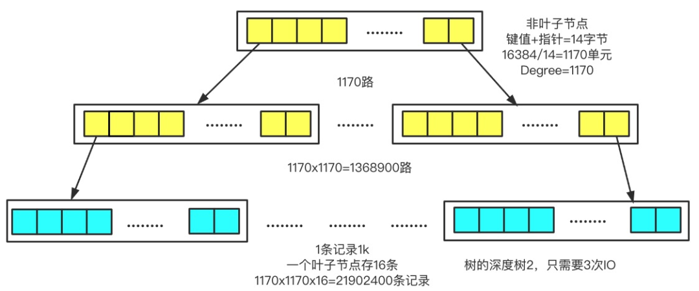
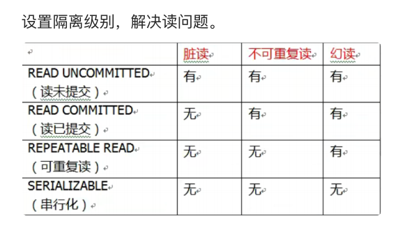

- 存储emoji: emoji占据4个字节的UTF-8字符, 而MySQL的utf8只有3个字节的UTF-8字符, 所以需要使用utf8mb4字符集
- varchar和char的区别: varchar是可变的, char是不可变的
- MySQL的分层: 分为三层
	- 连接层: 管理客服端的连接和权限验证
	- 服务层: 解析SQL语句/ 优化SQL
	- 存储引擎层: 负责数据的提取与存储
	binlog位于服务层
- 一条SQL语句的执行过程: 
	- 客服端发起连接请求, 发送SQL向MySQL服务器
	- 连接器处理请求, 进行权限验证
	- 解析器解析SQL, 是否有语法错误
	- 优化器优化SQL, 制定执行计划, 来决定它使用哪个索引, 表的连接顺序等等
	- 执行器执行计划, 调用存储引擎的接口来执行
	- 存储引擎查询到了数据, 返回给客服端, 客服端收到结果, 结束
- 常见的存储引擎: InnoDB, MyISAM, MEMORY, 除此之外还有:
	- MySQL在5.5之前用的还是MyISAM, 之后是InnoDB
	- InnoDB的哈希索引是自适应的
	- InnoDB在5.6之后支持全文索引
	- InnoDB的最小表空间略小于10MB, 最大表空间取决于页面大小
- ==日志文件有哪些==: 
	- 错误日志: 分析错误的
	- 慢查询日志: 优化性能的
	- general log: 所有的SQL语句
	- redo log(物理日志): 是重做日志，属于InnoDB引擎层, 记录物理层面的数据页的变更, 用于数据库崩溃后, 重启时能通过redo log把提交但还未刷盘的数据恢复过来
	- binlog(逻辑日志): 属于MySQL Server层, 记录的是逻辑层面的数据变更, 主要用于主从复制和数据恢复。
		- binlog的三种格式: 分别为statement, row, mixed
			- statement: 在这种格式下binlog里面记录sql原句
				- 缺点: 对于使用了now()这种事件函数的sql语句, 主从同步后数据不一致
			- row: 这种格式下binlog里记录的是具体的数据变化, 比如: 
				- Insert操作下row格式会记录新插入行的所有字段的值
				- 优点: 
					- 很好的保证了主从复制的一致性, 避免了statement格式里出现的问题
				- 缺点: 
					- 需要记录的数据量大, 比如插入, 批量修改等等, 需要把每条记录都记录, 影星性能
					- 进而导致文件体积大, 主从同步时, 网络IO高, 耗时长
			- mixed: 这种格式下默认使用statement格式, 对于某些可能会影响主从一致的sql语句改为row格式
	- undo log: 记录的是数据修改操作的“反向操作”, 用于回滚和MVCC

- WAL: 先写日志后刷盘, 即在修改操作将内存中的脏页刷入到磁盘前先将修改记录写入redo log, 这样即使系统崩溃, 也能根据redo log 进行重做
- MySQL崩溃重启后咋样回滚: InnoDB只需要重做最近一次CheckPoint之后修改即可(这不是重新执行SQL, 而是修改数据)
- redo log的写入过程: 先写到redo log buffer里面, 待事务提交后, 再刷盘到redo log文件中

- 为什么要[[../MySQL/两阶段提交与崩溃恢复机制]]: 保证binlog和redo log的一致性, 防止主从复制和事务状态的不一致
- **慢查询**: 
	- 什么是慢查询: 当SQL运行时间超过long_query_time就是慢SQL, 会被记录到慢查询日志中
	- 如何优化慢SQL: 
		- 启用慢查询日志, 从中找到超过指定执行时间的SQL
		- 使用 `show processlist`查看当前正在执行的SQL, 从中找到执行时间较长的SQL
		- 使用EXPLAIN查看慢SQL执行计划, 看有没有用索引, 然后优化
- ==MySQL如何优化==: 
	- 有索引不走索引咋办: 
		- 最直接的是可以使用`FORCE INDEX`强制指定索引  
		- 还可以试试`ANALYZE TABLE`重新收集统计信息, 让优化器拿到更准确的数据做判断
	- 索引优化: 
		- 限制每张表上的索引数量，建议单张表索引不超过 5 个
			- 这是因为索引会降低插入和更新的效率, 甚至有时候会降低查询效率, 因为MySQL需要选择如何优化查询, 索引越多, 选择权越多, 会增加MySQL优化器制定执行计划的时间, 降低查询性能;  而且, 索引也需要额外的存储空间
		- 如果使用联合索引，区分度最高的列放在最左侧, 最频繁使用的放在最左侧, 遵循最左前缀原则
		- 我们一般会对在 where 后的字段建索引，也会对在Order By、Group By 后的字段建索引，此时将两者的字段结合建立联合索引的效果 比单个地建立索引更好
			- 这是因为`SELECT age, city, name FROM user WHERE age = 20 AND city = 'Beijing' ORDER BY name;` 建立 (age,city,name)的索引比 建立(age,city)索引和建立(name)索引 的效果要好，因为这样在联合索引树下的叶子节点的name是已经排好序的，不需要再排序了。
	- SQL语句优化: 
		- 同时也要避免使用select*, join多表查询时小表驱动大表, 在==分页优化(**深分页**)==方面, 可以使用延迟关联(先在索引上快速"定位"，拿到目标id后，再去"取数据")和书签法(记录上一页最后一条 ID 的值，如 `WHERE id > last_id LIMIT 10`)这两种方式
			- 关于小表驱动大表(小表和大表的判定是看它们操作数据的多少, 而不是整个表本身的大小): 例如1000行的表和100万行的表. 在这个场景下, MySQL只需要把小表的数据加载到内存，只需要对小表的每一行数据在大表中进行一次查找，因此总共只需要查找 **1000 次**.  而大表驱动小表则需要查找100万次.
			- ==关于深分页==: 比如 LIMIT 100000, 10, MySQL在处理时会先扫描前100010行, 然后丢掉前100000行, 返回后10行, 偏移量越大, 扫描数据越多, 查询越慢
	- 表结构优化: 
		- 根据业务可以把经常用的列放到一张表里面, 避免多表联查
		- 适度反范式设计，在表中保留一些冗余字段, 避免多表联查
		- 优先选择符合存储需要的最小的数据类型，数据存储占用的空间越小，性能越好
		- 单表不要包含太多字段，查询效率低
			- `如果有冷门字段数据和热门字段数据，可以冷热分离，分成两张表`
		- 如果没有特殊原因使用 NULL 值，尽可能把所有列定义为 NOT NULL
	- SQL无法优化了还是慢咋办: 可以建宽表. 把多张表里所有需要查询的字段放到一张表里面, 再次需要查询时就变成了单表查询了.
		- 维护方式: 
			- 第一种可以通过binlog监听数据的变化, 实时同步到宽表
			- 第二种可以定时任务批量刷新到宽表
- ==select ... for update的含义和使用场景==: 
	- 它执行的是当前读, 会对查出来的行加排他锁, 其他事务不能修改该行, 直到当前事务提交或者回滚
	- 一般用于先查后改的场景, 比如扣库存, 防止库存变负数
	- 注意: 
		- `FOR UPDATE`要在事务中使用, 自动提交模式加锁马上就提交了, 而且where条件要走索引, 否则会锁全表
- ==explain==: 常看的字段有`key rows type Extra`, 通过这些可以查看该语句是否使用了索引, 预扫描的行数有多少行, 是否进行了全表扫描, 以及使用了filesort或临时表. 例如, 当type=ALL, Extra=Using filesort 时说明该表使用了全表扫描并且进行了文件排序(说明 MySQL 无法利用索引顺序，必须在内存中进行额外排序，消耗大量 CPU 和 I/O), 我会考虑通过建立索引或改写SQL的的方式来优化. 
	- 关于type, 从高到低的效率排序是 system、const、eq_ref、ref、range、index 和 ALL。一般来说,达到const, ref ,eq_ref即可, 这说明它使用了索引, 而对于范围查询, 达到range也是可以的
- ==高并发下可以使用join吗==: 并不建议. 因为join操作会在数据库内部进行表关联计算, 占用cpu和内存, 高并发时, 每个连接都做join, 数据库的cpu和内存很快就被打满了, 一旦出现慢SQL, 连接数耗尽, 整个服务就卡住了
	- 方法: 一般就是拆分成单表查询, 在应用层做数据组装.          举个例子, 要从AB两个表里去查询数据, A中只要ID, 数据在B表, 我们先根据条件从A表查找到ID, 在拿着ID去B表查找数据, 在代码里进行拼接.   虽然多了一次查询, 但是每次查询都是单表操作, 执行速度块, 数据库压力小, 整体的吞吐量会更高
- ==为什么InnoDB要用B+树做索引==:  B+树是一种自平衡的多路查找树, 它的每个节点可以有n个子节点. 这就使得它的树高很矮, 通常3,4层就可以存储几千万条数据, 有效降低了查询的IO次数;  同时, B+树的叶子节点只存储数据, 非叶子节点只存储键值对和指针, 同时叶子节点之间使用双向链表来连接.非叶子节点不存储数据, 可以在非叶子节点上存储更多的键值对, 而且叶子节点的双向链表让范围查询变得高效, 不需要回树, 多次遍历, 可以直接在叶子节点之间顺序访问
	- 对比其他数据结构: 
		- 哈希表: 只能等值查询, 不支持范围查询, 范围查询要扫描全表
		- 二叉树: 数据量大时树太高, IO操作频繁, 查询性能下降
		- B树: 每个节点既存储数据又存储键值对, 导致每个节点能放的索引键更少, 树更高, IO次数更多, 同时又因为B树的数据可能在任意位置, 所以范围查询效率不及B+树
	- B+树的叶子节点之间是双向链表, 方便范围查询和反向遍历。执行范围查询时, 可以从该范围的最大或者最小开始, 向后或者向前遍历
		- 举个例子: 从最大向最小检索, 首先从根节点开始，通过索引键值逐层向下，找到第一个满足条件的叶子节点。, 然后从利用双向链表向左边遍历即可
- ==InnoDB表的数据存储在哪里==: 因为InnoDB使用的是聚簇索引, 所以数据都存储在主键索引的叶子节点上, 索引和数据在一起.    
- ==覆盖索引是什么==: 覆盖索引就是查询所需要的字段全部在索引里面, 不需要回表
	- 判断方法: 使用EXPLAIN看执行计划, 如果Extra列显示 Using index, 那么就说明使用了覆盖索引
- 一颗B+树可以容纳多少数据: InnoDB中, 页的默认大小为16KB, 主键为bigint时, 3层的B+树即可存储2000w条数据
	- 非叶子节点只存储键值和指针, 即 8字节 + 6字节 = 14字节, 因为页默认大小为16KB, 那么有 16 * 1024 = 16384字节 一页, 根据下图即可明白
	- 
- B+树与B树的区别: 
	- B树在非叶子节点上既存储键值, 还有数据和指针, 使得单节点存储的键值数量变少,  如果数据较大, B树的非叶子节点只能存储几十个键值, 而B+树可以存储上千键值
	- B树的范围查询需要通过中序遍历逐层回溯, 而B+树只需要确定起始点, 通过双向链表顺序查询即可, 不需要回树
	- B树的数据可能存储在任意位置, 会使得查询时间与IO开销并不稳定, 而B+树的数据全在叶子节点上, 时间复杂度固定为O(logN), 查找稳定, 在高并发场景下稳定性至关重要
- ==聚簇索引==与非聚簇索引: 
	- **聚簇索引的叶子节点存储了完整的数据, 数据和索引是一起的**, InnoDB的主键索引就是聚簇索引, 叶子节点不止有主键值, 还有其他列的数据.  
	- 一张表只有一个聚簇索引, 如果没有的话, 优先使用第一个非空的唯一索引作为聚集索引, 如果还是没有, 那么会创建一个隐形的主键索引DB_ROW_ID(6字节).   
	- 非聚簇索引的叶子节点只包含了主键值, 需要回表去查找其他的数据, 像唯一索引,普通索引等等都是非聚簇索引 , 如果不想回表, 就需要使用覆盖索引
- ==回表==: 先通过非聚簇索引查找到主键值, 在通过主键值在聚簇索引中查找完整的数据
	- 代价: 需要访问额外的数据页, 如果不在内存中, 还需要在磁盘中读取, 造成额外的IO开销
- 最左前缀原则: 使用联合索引时, 必须从最左边的索引开始顺序使用, 才能命中索引
	- 为啥不从最左边就无法匹配呢: 因为联合索引在创建索引树时是按顺序构建的, 如果不从最左边开始, 那么MySQL无法判断后面的字段从哪里开始查询, 自然失效
- 什么是MRR机制: 通过非聚簇索引查找到主键ID后, 不直接回表, 先将ID放到缓冲区进行排序, 然后按顺序访问聚簇索引
- MySQL中锁有很多类型, 按锁粒度划分有行锁, 表锁等等, 按加锁的机制来分有乐观锁和悲观锁, 按锁的兼容性来分有共享锁和排他锁
- 行锁: InnoDB中最细粒度的锁, 锁定表中的一条数据, 允许事务访问表中的其他数据, 底层通过给索引加锁实现的.   这说明, 只有通过索引检索时才能加行锁, 否则会退化为表锁
	- 分为记录锁, 间隙锁和临建锁
		- **记录锁**：
		    - 锁定索引记录。
		    - **触发场景**：通常在通过**主键或唯一索引**进行**等值查询**，且**记录存在**时产生。
		- **间隙锁**：
		    - 锁住两个索引记录之间的空隙（不包含记录本身），阻止插入。
		    - **触发场景**：
	        1. **范围查询**（`WHERE id > 5`）。
	        2. **等值查询**但记录**不存在**（`WHERE id = 3`，表中无3）。
	    - **作用**：解决幻读问题（防止新数据插入到空隙中）。
		- **临键锁**：
			- **锁定范围**：同时锁索引记录和间隙, 范围左开右闭
		    - **默认锁机制**。
		    - **组成**：**记录锁 + 间隙锁**。
- 悲观锁和乐观锁: 
	- 悲观锁: 数据被访问时一定会发生冲突, 在处理过程中全程加锁, 保证只有一个线程能够访问数据.                       行/表锁都是悲观锁
	- 乐观锁: 并发操作并不总是会发生冲突, 因此读取数据时不加锁, 会在提交数据时检查数据是否被其他事务修改过.        通过版本号和时间戳机制来实现, 通常在表中添加version和timestamp字段来实现
- ACID:
	- **原子性**（`Atomicity`）：事务是最小的执行单位,事务的原子性保证了同一个事务里面的所有动作要不全部完成,要不全部失败
	- **一致性**（`Consistency`）：执行事务前后，数据保持合法状态，例如转账业务中，无论事务是否成功，转账者和收款人的总额应该是不变的；
	- **隔离性**（`Isolation`）：并发访问数据库时，一个用户的事务不被其他事务所干扰，各并发事务之间数据库是独立的； (解决了事务并发执行时的脏读, 不可重复读, 幻读)
	- **持久性**（`Durability`）：一个事务被提交之后。它对数据库中数据的改变是持久的，即使数据库发生故障也不应该对其有任何影响。
	- ==原子性==通过undo log保证, ==持久性==通过Redo log重放, 双写机制, 两阶段提交和CheckPoint刷盘保证, ===隔离性==通过MVCC(优化读操作, 通过保存数据的历史版本，让读操作不需要加锁就能直接读取快照，提高读的并发性能)和锁机制(默认临建锁)实现, ==一致性==通过其他三个共同实现
- ==隔离级别==: 
	- InnoDB 默认隔离级别为可重复读, 剩下的全是读已提交
	- 读未提交: 事务可以读取其他事务未提交的数据, 如果未提交的数据一旦回滚, 那么读取到的数据就成了脏数据
	- 读已提交: 事务可以读取其他事务已提交的数据, 即同一事物多次读取的结果不同
	- 可重复读: 事务多次读取相同数据的结果相同, 是默认级别, 同时通过MVCC与临建锁可以一定程度避免幻读
	- 串行化: 强制事务串行执行, 但是锁竞争问题严重
	- 
- ==MVCC==: 是多版本并发控制, 每次修改数据时生成一个新的版本, 不在原来的数据上进行修改, 并且每个事务只能看到它开始前已经提交了的数据版本
	- 解决了读写之间冲突的问题
    - 底层实现依赖undo log版本链和Read View
        - 每次修改数据时， 都会生成一个Undo Log记录， 每条记录都包含了三个隐藏字段， DB_TRX_ID： 最近修改该条数据的事务ID ， DB_ROLL_PTR： 指向undo log中的上一个版本， DB_ROW_ID： 标记该数据的
            - 通过DB_ROLL_PTR将不同版本形成一个版本链
        - 在查询(**快照读**)时生成了一个Read View， 记录当前活跃事务的ID的集合， 最小事务ID， 最大事务ID(当前系统中**已创建过的最大事务 ID + 1**), 以及当前事务ID等等， 通过与其他数据的DB_TRX_ID比较看是否能看到该数据版本
            - 如果DB_TRX_ID小于最小事物ID，那么就可以看到，如果大于最大事物ID，那么就看不到，如果在最大最小事物ID之间，那么需要看是否在活跃事物ID集合中，如果在，那么就不能看，不在则可以
    - 主要作用于可重复读与读已提交:
        - 可重复读隔离级别下，事物只在第一次select时生成Read View，之后复用该视图
            - RR 级别下，MVCC 解决了快照读的幻读问题，Next-Key Lock 解决了当前读的幻读问题
        - 读已提交级别下，事物会在每次查询时都生成新的Read View，确保可以看到更新的数据
        
		- 在 RC 中，只会对索引增加 Record Lock，不会添加 Gap Lock 和 Next-Key Lock
		- 在 RR 中，为了解决幻读的问题，在支持 Record Lock 的同时，还支持 Gap Lock 和 Next-Key Lock

- ==为什么不建议用长事务==: 主要有三个问题
	- 锁占用时间过长: 事务持有的行锁了, 间隙锁了等等, 在事务提交之前不会释放, 这就使得其他想要修改该条数据的事务会阻塞, 并发能力下降
	- undo log无法回收: MVCC依赖于undo log维护历史版本, 如果有任何一个长事务没有提交, 那么在这个事务开启之后的所有的undo log都不能被清理, 时间一长, 回滚段也会越来越大, 甚至撑爆磁盘空间
	- 回滚代价大: 如果这个长事务需要回滚, 那么就需要重做该事务期间所有修改的逆向操作.  事务越长, 回滚的数据量越大, 耗时很长, 期间数据库性能会有很大影响
- 分库分表: 
	- 分库: 
		- 垂直分库: 根据业务的不同将他们分到不同库里面, 比如用户, 登录, 权限分到用户库里面, 商品, 类别, 价格放到商品库里面, 优惠券, 秒杀放到活动库里面
		- 水平分库: 按照一定的策略将一个表中的数据拆分到多个库里面, 例如, 哈希分片和范围分片等等, 将用户id进行哈希或者取模, 分到不同库里面
	- 分表: 
		- 水平分表: 当单表数据超过了500w条数据, 可以考虑水平分表, 比如文章, 可以分为article0, article9999这样的
		- 垂直分表: 依旧例如文章, 查询时, 如果把文章的详细信息与基本信息放到一起, 会占用很多的IO, 导致查询变慢, 此时就可以把常用的文章作者, 文章标题等等常用的信息拿出来, 用于不需要文章详细信息的查询, 这就是垂直分表
- InnoDB和MyISAM的主要区别: InnoDB和MyISAM最核心的区别在于对事务的支持。InnoDB是事务型引擎，支持ACID特性、行级锁和外键约束，通过Redo Log和Undo Log来保证事务的持久性和回滚，崩溃后也能恢复。而MyISAM不支持事务，只有表级锁，读写会相互阻塞。在索引上，InnoDB使用聚簇索引，数据文件本身就是索引的一部分；MyISAM使用非聚簇索引，索引和数据是分开存储的。所以，对于需要高并发写入、数据一致性要求高的OLTP系统，我们肯定选InnoDB。如果是读远大于写的场景，比如一些历史报表查询，MyISAM的简单结构可能在某些简单查询上更快，但现在已经很少用了。