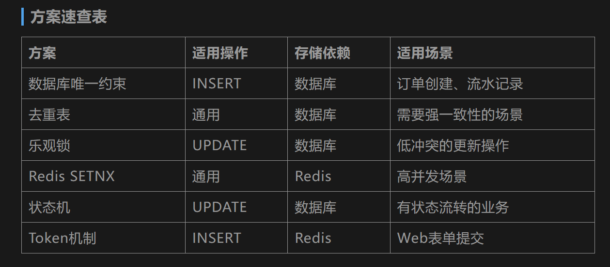

## 什么是幂等
- 同一个操作, 执行一次或者执行多次, 对**系统**产生的影响是一样的
## 实现幂等的方案

### 数据库唯一约束

- 主要用于插入操作
- 这种就是使用数据库的**主键索引**或者是**唯一索引**来做约束防止重复数据
- 典型的场景有**创建订单**. 举个例子, 如果数据库使用自增主键ID做主键, 那么每次的INSERT都会成功, 重复插入有重复订单.  解决办法是在发起创建请求时先由客户端生成一个**全局唯一**的订单号, 用这个作为唯一索引去插入数据库中, 如果有重复插入就会被唯一约束拦住
- 有一个重要的细节: 如果重复操作被唯一约束拦住了, 那么应该给客户端返回成功, 防止继续重试, 造成资源浪费
### 去重表

- 就是专门创建一张用来记录已经处理过的请求, 每次处理前先从该表检查是否处理过
- 流程: 
	- 客户端在请求时携带一个全局唯一的幂等号
	- 服务端收到请求后, 会先尝试往驱虫表中INSERT这个幂等号
	- 如果成功, 说明是第一次执行, 继续后续的业务
	- 如果失败, 说明是重复请求, 直接返回
- 注意流程第二步一定是要使用INSERT, 不能先SELECT再INSERT.  先查询再插入可能会有两个并发请求共同INSERT到不存在, 然后都去执行业务逻辑，幂等就失效了.

### 乐观锁(版本号)

- 主要用于解决更新操作, 特别是ABA问题
- ABA: 比如商家要修改订单的快递单号, 先把单号设置为了666, 然后发现不对, 要改成888, 如果是多线程环境下, 可能会
	- 请求A进来要把订单号改为666
	- 请求B进来要把订单号改为888
	- 请求B先到服务端, 改为了888
	- 这时请求A因为网络延迟, 后到达服务端, 改为了666
- 最终为666, 但是商家想要888

- 解决办法就是更新数据的时候加一个version字段
- 客户端读取数据时拿到当前version值, 更新时带上这个值

### Redis 的 SETNX
- `set key value nx ex timeout` 该命令天生是原子操作
- 优点是性能高, 天然适合高并发, 缺点是业务逻辑执行成功, Redis宕机数据就丢失了; 而且Redis和MySQL是两个不同的存储, 无法用本地事务保证原子性

### 状态机
- 适合用于有明确状态流转的业务, 比如订单状态: 待支付 -> 已支付 -> 已发货 -> 已完成 这种
- 方法就是在表中加一个status字段即可, 更新时加上该字段作为条件

### Token机制
- 主要用于防止表单重复提交
- 流程:  
	- 首先页面加载时, 前端向后端申请一个一次性Token
	- 然后用户提交表单时带上Token, 后端来校验是否存在该Token, 存在就删除Token并且处理请求; 不存在就说明Token已经被使用过了, 拒绝请求

## 幂等号如何生成

- 一般是客服端生成, 客户端在第一次发起请求时生成一个UUID作为幂等号, 重试时携带同一个幂等号
- 注意: 幂等号必须在第一次请求时生成, 后续的重试复用同一个

## 异常处理策略

- 一般是分为业务异常与系统异常
	- 业务异常: 比如参数校验失败, 用户不存在这种, 这种情况不删除幂等号. 因为这种情况即使客户端重试也不会改变结果, 保留幂等号可以防止客服端做无意义的重试
	- 系统异常: 比如数据库连接超时, 下游服务不可用等等. 这种情况业务逻辑没有真正执行成功, 应该删除幂等号, 允许客服端在系统恢复后重试

- 还有一种就是, 幂等号已经存储了, 但是业务逻辑执行一半系统崩溃了, 重启后幂等号存在但是业务没有完成, 后续重试机制也会失效
- 一般有两种想法: 
	- 第一种使用数据库本地事务把「记录幂等号」和「执行业务逻辑」放在同一个事务里. 业务没有完成, 幂等号也不会被提交
	- 第二种就是接受这种极端情况, 碰到了使用告警加人工介入处理

- **一般使用第二种**
	- 这是因为**在工程实践中，为极低概率的异常场景设计过于复杂的自动恢复机制，往往不如简单的告警加人工处理来得划算。**

## 幂等组件(Redis)自身挂了咋办

- 有两种: 
	- 降级放行: 这种直接跳过幂等检查, 去执行业务. 比如发送短信类业务, 容错高
	- 拒绝请求: 直接返回错误. 比如资金类业务